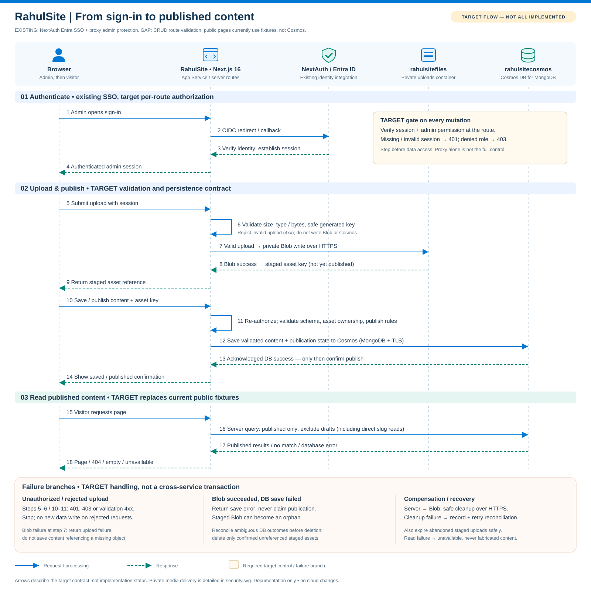
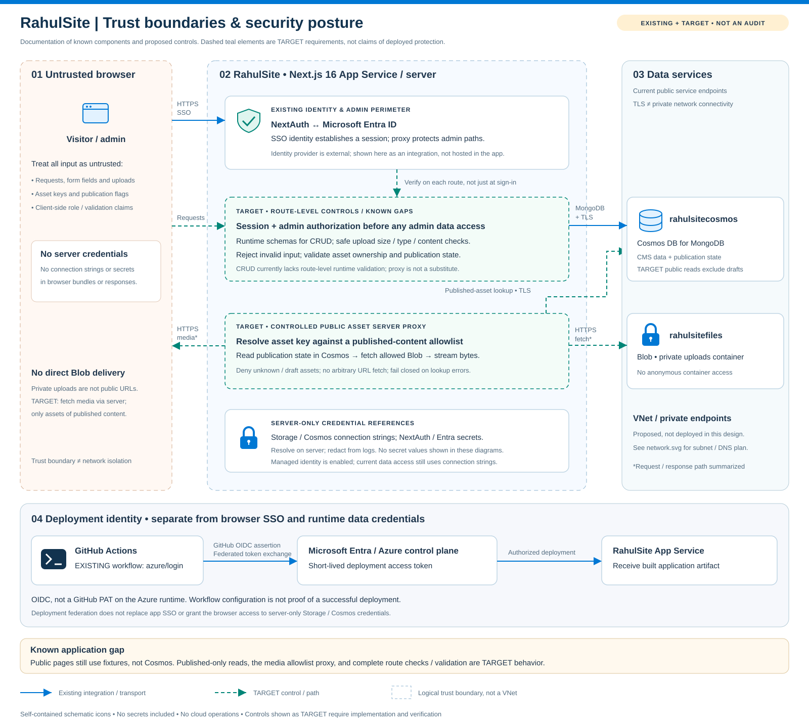
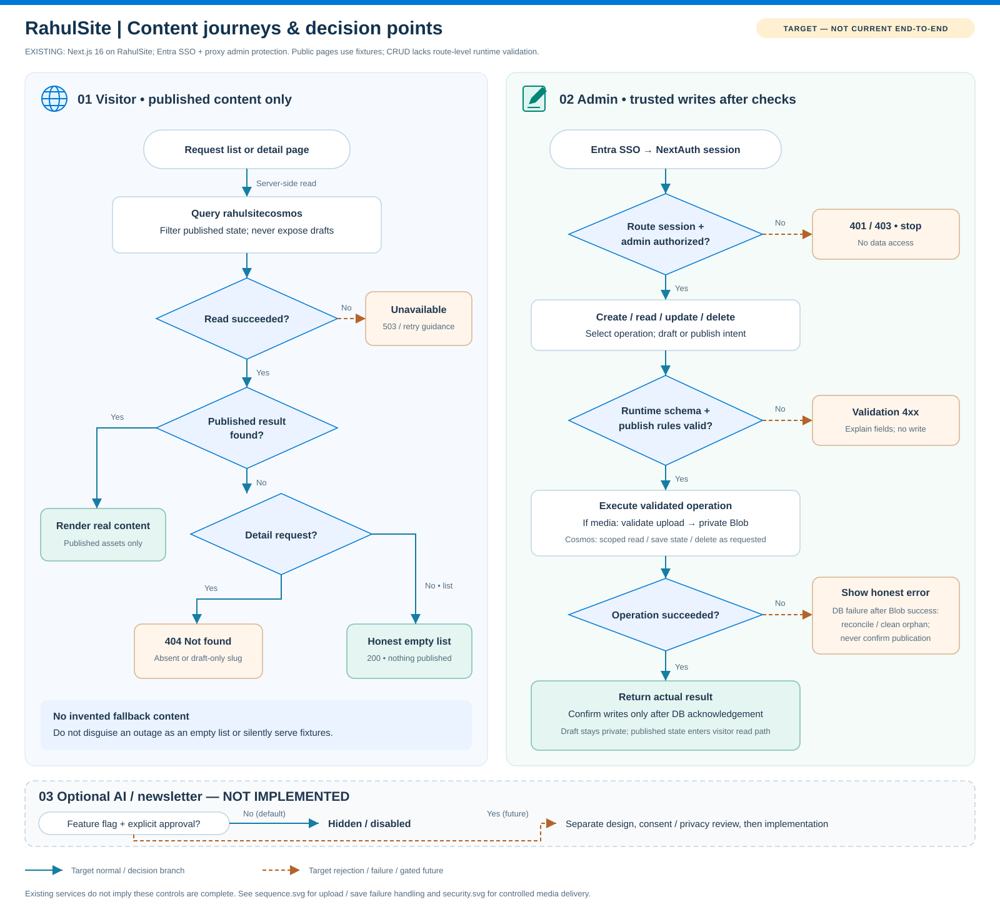

# RahulSite — consolidated low-level design

**Version:** 1.0 · **Date:** 16 September 2026 · **Status:** Draft design baseline
**Owner:** Rahul / project maintainer · **Release approval:** owner plus QA/security evidence

This combines product intent, HLD, LLD, design-system and backend planning into one
implementation specification. It is not a claim of production readiness.
Acceptance IDs refer to [need-and-acceptance.md](need-and-acceptance.md).

## 1. Scope, terminology and decision record

**Existing:** repository behavior or dated infra record. **Target:** required release
behavior not yet fully implemented. **Optional:** approved separately; disabled or
truthfully unavailable until configured. Infra snapshot is historical, not a fresh
cloud audit. No resources were deployed while consolidating this design.

| Decision | Resolution | Reason / consequence |
|---|---|---|
| ADR-01 Framework | Preserve Next.js 16.3.2 / React 19 baseline; check package versions before changes | Supersedes older Next.js 15 documents |
| ADR-02 Persistence | Cosmos DB for MongoDB; Mongoose connection with native collections | Preserve existing code and provisioned account; no Prisma/PostgreSQL migration |
| ADR-03 Authentication | NextAuth JWT sessions; configured Entra/Google providers; `/admin` sign-in | Supersedes custom password/bcrypt login; Google is not currently configured per infra |
| ADR-04 Hosting | Azure App Service; GitHub Actions Azure OIDC | Workflow exists; successful latest deployment remains unverified |
| ADR-05 Publication | Shared server content repository for public pages and CMS | Target; public fixture imports currently break publish-to-public behavior |
| ADR-06 Content authoring | Store Markdown body, parse/render safely on server; no arbitrary executable MDX | Target single workflow; migrate legacy content explicitly |
| ADR-07 Media | Private Blob container; server-controlled published-asset delivery | Target fixes private-URL mismatch without making all uploads public |
| ADR-08 Network | Public endpoints baseline; VNet/private endpoints are proposed only | Verify plan support, costs, DNS, ranges before provisioning |
| ADR-09 Extra services | AI, newsletter, scheduler, video sync and telemetry integrations optional | No unconfigured service is represented as functional |
| ADR-10 Visual identity | Original navy/purple/orange world with approved avatar art | Do not copy reference websites or imply an unapproved likeness |

## 2. Product and user journeys

Primary audiences: readers of technology articles, travel readers, video learners,
project reviewers and the owner managing published content. No public account is
required to browse. The promise is “Build. Explore. Share.” with truthful authored
content, enjoyable interaction and fast accessible navigation.

| Journey | Target outcome | Acceptance |
|---|---|---|
| Discover | Home → article/project/video/travel → useful authored detail | FE-01–FE-05 |
| Personalize | Open gear → adjust world → immediate visuals → reset | FE-06, UI-04–UI-06 |
| Publish | SSO → draft → upload → preview → publish → public page | BE-01–BE-05, FE-02 |
| Recover | Invalid URL / unavailable DB / failed upload → explicit safe state | FE-03, BE-03–BE-05 |
| Optional discover/subscribe | Configured AI or newsletter only; navigation always works | FE-08, BE-10 |

Home hierarchy: navbar, hero, Current Adventure, Architecture Spotlight, Latest
Articles, Latest Videos, optional AI/newsletter, cinematic footer. Empty sections
must show meaningful empty states or be intentionally omitted, never padded with
invented biography. A verified architecture spotlight may be an authored project
with title, summary, category, intended audience, conceptual diagram and update
date; no separate service is required.

## 3. Architecture and component responsibilities

| Layer | Existing location | Responsibility / target boundary |
|---|---|---|
| Composition | `app/layout.tsx`, `app/page.tsx` | Server shell, metadata, semantic landmarks, providers |
| Public content | `app/blog`, `app/projects`, `app/adventure`, `app/travel`, `app/youtube` | Server-read published records; travel aliases get one canonical URL |
| Scene/UI | `components/sections`, navigation and footer | Client interaction only where needed; content never waits for scene |
| Local state | `stores/world.store.ts` | World preferences, not credentials, CMS data or server cache |
| CMS | `app/admin`, `components/admin` | Authenticated editors, validation feedback, explicit save/publish states |
| API | `app/api/admin`, `app/api/auth` | Authorization, validation, services, normalized responses |
| Persistence | `lib/db.ts`, `lib/schemas.ts` | Cached DB connection and native collection access; target runtime schemas |
| Identity | `lib/auth.ts`, `proxy.ts` | Session creation and coarse route guard; target checks in every handler |
| Assets | `public`, Blob `uploads` | Approved shipped art vs uploaded CMS media |

Target layering: route/page → authorization/validation → content/media service →
repository/SDK. Public pages call a server-only published-content repository, not
protected admin HTTP routes. No DB secret or storage SDK initialization enters
client bundles. Split new modules by responsibility only when implemented; this
document does not require moving the current application tree.

### Current gaps (inspection, not test results)

| Gap | Observed behavior | Required change |
|---|---|---|
| G-01 | Public lists/details/RSS import fixtures | Published Cosmos reads, consistent DTOs and cache invalidation |
| G-02 | Unknown slugs fabricate/fall back to content | Real 404; drafts never public |
| G-03 | Compile-time interfaces only; arbitrary POST/PUT bodies | Runtime allowlisted schemas; immutable fields and validation errors |
| G-04 | Admin GET returns fixture success on DB failure | Explicit production 503; fixtures only in development |
| G-05 | Some admin delete calls use collection route | Use `/type/id`; test all screens |
| G-06 | Blob URL returned although container is private | Controlled media delivery and durable asset metadata |
| G-07 | No explicit indexes/pagination; rejected connect promise cached | Verified indexes, bounded paging, connection recovery |
| G-08 | Admin world enums differ from active store | Shared schema; separate site defaults from local preferences |
| G-09 | Test script absent; workflow uses `--if-present` | Real tests and mandatory release gates |
| G-10 | AI/YouTube sync/newsletter APIs absent | Optional scope; no false successful integration |

## 4. Frontend and content specification

### Routes

Public: `/`, `/blog`, `/blog/[slug]`, `/projects`, `/projects/[slug]`, `/adventure`,
`/adventure/[slug]`, `/travel`, `/travel/[slug]`, `/youtube`, `/about`, `/contact`,
`/rss.xml`. Preserve existing links; choose `/travel` as the target canonical route
and redirect aliases only with explicit tests. Admin: `/admin`, `/admin/dashboard`,
and existing blog/adventures/projects/settings/youtube editors. Use documented
not-found, loading and error boundaries. Search is a target bounded published-only
query, not a fake local result count. Add sitemap and canonical metadata as targets.

Blog: title, excerpt, authored Markdown, category/tags, estimated read time,
published/updated dates, TOC, accessible highlighting/copy, related content, RSS,
OG and structured data, captions/alt text and print styles. No invented statistics.
Travel: story, destination/country/cities, verified dates, cover, gallery, captions,
optional approximate map and text fallback, swipe + buttons + keyboard. Projects:
problem, approach, stack, diagrams, lessons, links and results only if supplied.
Videos: real YouTube ID, authored/verified metadata, topic filter and click-to-load
privacy-enhanced embed; no autoplay audio. Missing external URLs are not clickable.

### Read/write and cache lifecycle (target)

Publish commits to DB before reporting success, then invalidates relevant server
cache keys and RSS/list/detail paths. Draft preview is admin-only and no-store.
Authenticated routes are no-store. Published cache maximum staleness target is
60 seconds; mutation-driven invalidation should refresh sooner. Retries must not
duplicate creates. Display explicit retryable errors; do not hide outages with
fixtures. Build must not require live database credentials to render static shell.

## 5. UI, responsive and motion specification

| Token / rule | Target |
|---|---|
| Base / elevated / card | `#081229` / `#0D1B3E` / `rgba(13,27,62,0.7)` |
| Technical / signature / hover | `#6958FF` / `#FF8A3D` / `#FF9F5A` |
| Subtle border | `rgba(105,88,255,0.2)`; not the sole focus indicator |
| Typography | Space Grotesk display, Inter body, JetBrains Mono code; sensible fallbacks |
| Text / status tokens | Define foreground/muted/success/warning/danger by measured contrast; do not assume accent contrast passes |
| Layout | Centered max-width 1400px, logical reading order and deliberate section spacing |
| Controls | At least 44×44 CSS px target, visible focus, distinct disabled/error/success states |
| Navbar | Approved avatar mark, brand, Blog/Travel/YouTube/Projects/About; one configured coffee CTA |

| Viewport | Required layout |
|---|---|
| 360×800 | One column; text before scene; static fallback; bottom-sheet controls |
| 390×844 | Touch travel controls with equivalent visible buttons |
| 430×932 | No fixed trigger overlaps content or system-safe areas |
| 768×1024 | Two-column cards; accessible drawer |
| 1024×768 | Split hero if sufficient room; protect head/hands |
| 1280×800 | Full scene, closed gear panel by default |
| 1440×900 | Restrained pointer parallax; no scroll hijacking |
| 1920×1080 | Centered 1400px content; up to three article columns |

WCAG 2.2 AA: semantic landmarks, skip link, heading hierarchy, accessible names,
normal text contrast ≥4.5:1, large text and essential non-text ≥3:1. Validate zoom
to 200% and reflow at 320 CSS px. Drawers trap focus only while modal, close on
Escape/outside click, restore trigger focus and expose state. Decorative canvas
is hidden from assistive tech; meaningful fallback images have alt text.

### World and avatar

Existing hero uses image artwork and Framer Motion; `AvatarScene` is not mounted
on the homepage. R3F dependency presence is not a completed 3D experience. Current
store enums: weather `clear|rain|storm`; modes `work|travel|creator`; density default
0.5, size 1.0; companions enabled. Target density 0–1, size 0.5–2; style
Classic/Sunset/Storm; Surprise Me samples only valid combinations; Reset restores
defaults. Persist versioned validated local preferences and recover corrupt data.
Site-wide defaults (if enabled) and visitor overrides must share a schema.

Target rigged state graph: `idle → mode-enter → mode-loop → mode-exit → idle` for
work/travel/creator; transient `ai-listening` and `celebrate` return to the prior
safe state; footer uses `footer-idle`. These are the original 13 states. Queue or
cancel rapid mode changes without overlapping clips or teleportation. AI-listening
is not evidence of an active AI service. Static pose equivalents remain acceptable
for core release; animated tier requires approved GLTF/GLB and review.

Scene: cloud/laptop avatar, soft key/cool fill/warm sunset rim/contact shadows,
stable camera, clean silhouette, no clipped hands or floating feet. Lazy-load 3D,
compress textures, adapt DPR, stop offscreen/hidden-tab rendering and dispose
resources. Reduced motion disables loops, parallax, rain particles and nonessential
idle movement. Original optional keyboard easter eggs use polite live announcements;
never flash, autoplay sound or block navigation. Footer uses the same character;
head-only peeking image must not create layout shifts or steal focus.

### Asset inventory and approval

Existing public files include avatar-3d-clean.png, avatar-3d-head-only.png,
avatar-travel-clean.png, avatar-creator-v2.png and sun-symbol.png (inspection).
No GLTF/GLB was found. Use user attachments as references, not assumed filesystem
assets or licences. Before publication record source, owner approval, usage rights,
dimensions, alt/decorative classification and variant. The supplied licensable sun
preview is not evidence of a licence. Do not remove watermarks or claim unapproved
likeness. Keep public brand art vendor-neutral; Azure icons are appropriate only
in engineering architecture documentation.

## 6. Data model and lifecycle

Existing collections in `rahultech_prod`: `blogs → posts`, `adventures → adventures`,
`projects → projects`, `videos → videos`, `settings → settings`. Current interfaces
are not runtime validation and native writes bypass Mongoose schemas.

| Type | Existing interface fields | Target additions / rules |
|---|---|---|
| Post | id, slug, title, excerpt, content, category, readTime, publishedAt, isPublished; optional externalUrl/timestamps | tags, status, updatedAt, revision; sanitized Markdown rendering |
| Adventure | id, slug, destination, country, countryCode, cities, excerpt, visitedAt, isCurrent, coverImage, photos, highlights, travelStyle, emoji, lat, lng; optional endedAt/profilePhotoAtLocation/timestamps | status, revision, authored body; lat −90…90/lng −180…180 optional and approximate |
| Project | id, slug, title, description, tech; optional githubUrl/timestamps | status, revision; optional body, demo and architecture metadata |
| Video | id, youtubeId, title, topic; optional timestamps | status; optional verified duration/publishedAt/thumbnail |
| Settings | Arbitrary documents today | Singleton versioned record; allowlisted site/world defaults; no secrets |
| Media (target) | Not modeled | id, blobName, contentType, bytes, hash, alt/caption, owner, state, createdAt, linkedContentIds |
| Audit (target) | Not implemented | actor stable ID, operation, entity ID, result, requestId, timestamp; no tokens or body content |

Target common rules: UUID IDs server-generated and immutable, URL-safe lowercase
slug max 120, title max 200, excerpt max 500, Markdown max 200k characters; reject
unknown fields and unsafe URLs/operators. Use UTC ISO timestamps, set createdAt
once and updatedAt on every write. Validate with runtime schemas (e.g. Zod when
installed), derive DTO types from those schemas. Limits are proposed defaults to
review before migration, not current enforced behavior.

Publication: `DRAFT → PUBLISHED → ARCHIVED`; unpublish returns to DRAFT. No
SCHEDULED state is enabled without a configured reliable scheduler. Public reads
filter PUBLISHED. Map legacy isPublished into status via explicit migration; never
infer publication from date alone. Proposed optimistic revision match returns 409
on stale edit; id and createdAt cannot be changed through PUT.

Indexes (target, validate Cosmos Mongo support/throughput first): unique id,
unique slug for routable collections, status+publishedAt for lists, youtubeId
uniqueness if one record per video. Paginate max 50/default 20 with stable cursor
and ID tiebreaker. Deduplicate before unique index creation; restore point and
rollback required. Cosmos free tier does not guarantee every throughput/config
choice is free; measure RU cost and verify backup settings.

## 7. API contracts and errors

### Existing contract (preserve until coordinated migration)

| Method / path | Request | Success | Known errors |
|---|---|---|---|
| GET `/api/admin/data/:type` | Type allowlist | 200 `{ok:true,data,source}` | 400 invalid type; proxy 401; DB failure may return fixture 200 |
| POST `/api/admin/data/:type` | JSON object, currently not validated | 200 `{ok:true,data}`; IDs/timestamps normalized | 400 type; 401; 500 DB |
| PUT `/api/admin/data/:type/:id` | JSON `$set` data, currently not validated | 200 `{ok:true,data}` | 400, 401, 404, 500 |
| DELETE `/api/admin/data/:type/:id` | No body | 200 `{ok:true}` | 400, 401, 404, 500 |
| POST `/api/admin/upload` | Multipart `file` | 200 `{ok:true,url,blobName,size,mimeType}` | 400 file/type/size; 401; 500 missing config |
| GET/POST `/api/auth/[...nextauth]` | NextAuth-managed flow | Provider/session-specific | NextAuth-managed failures; do not wrap OAuth responses |

Target envelope for application JSON only: success `{ok:true,data,requestId}`;
failure `{ok:false,error:{code,message,fields?},requestId}`. Keep `ok` for
compatibility; migrate every client/error parser with tests before replacing the
current string error. POST creation should become 201. Use 400 validation, 401 no
session, 403 denied permission, 404 missing, 409 conflict, 413 upload size, 415
media type, 429 rate limited (+Retry-After), 503 dependency unavailable, 500
unexpected sanitized error. Existing codes are not claimed to match this target.

Target public APIs are unnecessary for server rendering initially. Introduce a
bounded search route or media route only with explicit contracts. Proposed media
GET `/api/media/:assetId`: published assets only (or authorized admin preview),
known immutable blob mapping, safe Content-Type, nosniff, ETag and controlled cache;
support bounded range streaming for video. Never accept an arbitrary upstream URL.

### Upload target

JPG/JPEG/PNG/WebP ≤20 MiB; MP4 ≤100 MiB (MiB = 1024² bytes). Existing MIME-prefix
and extension checks are insufficient: add byte signature validation, decompression
and image dimension limits, filename normalization, random blob IDs, streaming /
bounded memory and trusted origin checks. Validate before writing. Uploaded media
starts unlinked; publish references an approved asset. Serve private media through
controlled proxy; do not store expiring SAS as canonical content URL. Malware
scanning/quarantine is a planned control whose service/cost needs approval.

## 8. Security design

| Threat / boundary | Required control | Verification |
|---|---|---|
| Browser → admin API | Handler-level admin session/allowlist checks, not UI guard alone | Direct unauthenticated and non-admin requests |
| Cookie-auth mutation | Same-origin/CSRF protection and trusted content types | Cross-origin negative test; NextAuth protects its own flow only |
| Untrusted JSON / Markdown | Schema allowlist, sanitized render, safe URL schemes | Operator injection, stored XSS and malformed-body tests |
| Upload / delivery | Size+signature checks, published-asset authorization, no arbitrary fetch | Spoofed MIME, traversal, draft-media access, range tests |
| Session privileges | Re-evaluate authorization on sensitive mutations; session revocation strategy | Remove allowlisted user and verify denial |
| Secrets | Server-only settings; redact logs, isolate build artifacts, rotate exposed tokens | Secret scan, bundle/artifact inspection |
| Azure CI | Workflow OIDC federation + least privilege; protected branch/environment | Verify federated subject and permissions; no static PAT deployment |
| Abuse / outages | Bounded body/query/time, distributed rate limits for exposed mutations/search | 429 and timeout tests; don't silently retry non-idempotent writes |

Entra identity configured in infra is not proof of end-to-end login. Validate issuer,
audience, tenant/account types, callback URLs and allowlist behavior. Public readers
must not be forced through App Service Easy Auth unintentionally. Security headers
target: CSP tested with required assets/embeds, HSTS after HTTPS review, nosniff,
Referrer-Policy, frame restrictions and restrictive Permissions-Policy.

Storage has Microsoft-managed at-rest keys; Cosmos snapshot has no CMK URI. TLS
is required in transit. These encryption keys differ from account access keys.
For access-key rotation identify which key every consumer uses, regenerate only
the inactive key, switch/verify consumers, then rotate the old key. Never assume
secondary/key2 is inactive. NEXTAUTH_SECRET changes may invalidate sessions.
No rotation automation or Key Vault deployment is claimed. Never retain tokens
shared in chat; revoke exposed credentials. Proposed managed identity for Blob
requires explicit SDK and RBAC changes before removing connection strings.

## 9. Reliability, performance and observability

Target: reset failed cached connection promises; bounded connection timeouts;
retry transient reads with backoff and jitter; idempotency keys for retried creates.
Use cached last-good published content only when clearly designed, never fictional
fixture success. Separate liveness from dependency readiness. Structured logs:
requestId, route, duration, result/status, dependency failure class, no secrets,
tokens, full prompts or unnecessary personal data. Metrics: latency, 5xx, upload
failures, auth denials, Cosmos RU/throttle, deployment health. Monitoring service
and alert routing must be selected/configured; not inferred from diagrams.

Performance release targets: mobile p75 LCP ≤2.5s, INP ≤200ms, CLS ≤0.1; lab CLS
≤0.02 and Lighthouse accessibility ≥95 with no serious/critical accessibility
findings. Original LCP &lt;1.2s / CLS=0 remains a stretch target, not a false measured
claim. Lab: production build, mobile throttling, three runs/median, named browser
and hardware. Real-user p75 needs sufficient traffic and cannot be inferred from
Lighthouse. Proposed initial JS budget ≤250 KiB gzip excluding deferred 3D/embeds;
initial hero poster ≤300 KiB. Confirm baseline before approving exceptions.

Proposed recovery objectives pending owner approval: content RPO ≤24h, RTO ≤4h.
Verify Cosmos backup mode/retention and Blob recovery settings; rehearse restore
to isolated resources. Do not promise objectives without configuration and evidence.

## 10. Deployment, testing and rollout

Existing workflow: push main / workflow_dispatch; Node 24; npm install; build and
test `--if-present`; artifact transfer; azure/login with federated IDs; deploy to
RahulSite Production. A missing test script can pass this pipeline without tests.
Target: lockfile install (`npm ci` when lockfile present), mandatory typecheck/lint/
tests/build, secret scanning, minimum artifact scope including required hidden Next
output, no .env or dev secrets, reproducible artifact and least-privilege OIDC.
Verify runtime startup, artifact content, callback settings and health before
claiming success. The repo source/build directory is its root, not nested rahultech.

Test layers: schema/state unit tests; auth/data/upload integration with real local
dependencies or isolated test resources where possible; full publish/read/delete
E2E; all eight viewport snapshots; manual keyboard/screen-reader checks; unavailable
DB/Blob/auth, concurrency and rollback tests. Mocks supplement, never replace,
proof of the real persistence/media path. Use seeded synthetic content explicitly
marked test-only and cleanup scoped to test IDs.

Rollout order: (1) runtime contracts and authorization; (2) public content service
and migration; (3) media delivery; (4) editor flow fixes; (5) visual/asset refinement;
(6) automated gates and staging verification; (7) owner-approved production release.
Preserve a last-known-good artifact/commit, deploy it for rollback if health checks
fail; no blind DB rollback after new writes. Prefer additive schema changes. Never
force-push shared history to bypass merge or auth failures.

## 11. Optional scope and open decisions

- Full rigged 3D tier awaits approved model/licence and animation assets.
- AI companion awaits provider/model/budget/privacy approval, published-only
  retrieval, citation rules, rate limits and injection evaluation. No AI resource
  or API currently exists. It must never invent Rahul's views or history.
- Newsletter awaits provider, consent/privacy, duplicate-safe subscribe,
  confirmation/unsubscribe, bot protection and delivery verification.
- Video sync needs provider credentials/quota and a real scheduler; manual curation
  remains valid. Analytics needs consent/privacy/retention decisions.
- Domain, coffee/social URLs, biography/travel approval, backup objectives and
  security monitoring owners remain owner decisions, not invented values.
- VNet/private endpoint/Key Vault design is optional hardening; validate cost and
  capability before accepting it as an implementation task.

## 12. Traceability and change control

| LLD area | Acceptance group | Evidence owner |
|---|---|---|
| 2–4 Routes/content | FE-01–FE-05, FE-07 | Frontend + QA |
| 5 Design/assets/world | FE-06, UI-01–UI-07 | UI + Motion + Accessibility |
| 6–7 Models/APIs/media | BE-02–BE-05 | Backend + QA |
| 8 Security | BE-01, BE-06–BE-07 | Security |
| 9–10 Operations/release | FE-09, BE-08–BE-09 | Performance + DevOps |
| 11 Optional services | FE-08, BE-10 | Product + integration owner |

See [source consolidation](README.md) for input documents. Version changes must
include rationale, affected criteria, migration/recovery impact and updated
diagrams. This consolidation edits documentation only; all implementation gaps
remain open until verified with reproducible evidence.