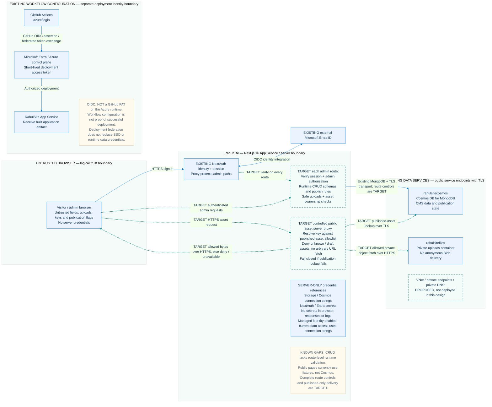

# RahulSite architecture diagrams

Documentation only. No application code, dependencies, or cloud resources are changed.

| Illustration | Editable source below | Status |
| --- | --- | --- |
| [Network](network.svg) | Network architecture | Exact copy of [the existing network illustration](../../docs/rahulsite-network.svg); existing resources plus proposed VNet |
| [Sequence](sequence.svg) | Sign-in, upload, publish, read | **TARGET**, using existing services; not an implemented end-to-end contract |
| [Flowchart](flowchart.svg) | Visitor and admin decisions | **TARGET**, including truthful errors and gated future features |
| [Security](security.svg) | Trust boundaries and controls | **EXISTING** integrations versus **TARGET** controls and known gaps |

The SVGs are standalone illustrations with embedded styles, primitive icons, accessible titles/descriptions, labeled arrows, and legends. The Mermaid blocks are semantically equivalent editable sources, not pixel-identical renderings. Mermaid rendering requires a Mermaid-capable viewer; the SVGs do not require scripts, external fonts, or network access.

## Status and interpretation

- **EXISTING:** Next.js 16 on App Service **RahulSite**, Cosmos DB for MongoDB **rahulsitecosmos**, Blob Storage **rahulsitefiles** with a private **uploads** container, NextAuth Entra SSO, and proxy admin protection.
- **KNOWN GAPS:** CRUD lacks route-level runtime validation. Public pages currently render fixtures rather than reading Cosmos. Do not infer complete route authorization, published-only querying, safe upload handling, or controlled media delivery from the existence of the services.
- **TARGET:** per-route session/admin checks, runtime validation, staged uploads, validated publication, published-only server reads, and the controlled public asset proxy. These are requirements, not claims of completion.
- **EXISTING WORKFLOW CONFIGURATION:** GitHub Actions uses OIDC with `azure/login`. It does not require a GitHub PAT on the Azure application runtime. Configuration alone does not establish successful deployment.
- **NETWORK COPY CAVEAT:** The untouched network SVG retains its original “CI/CD (pending verification)” label and original resource snapshot text. This is intentional preservation, not a contradiction of the known OIDC workflow configuration and not a new live infrastructure verification.
- **PROPOSED NETWORK:** outbound VNet integration, private endpoints and private DNS are a target design, not deployed controls. A private Blob container does not imply a private network endpoint. Example CIDRs are not allocated ranges.
- No AI or newsletter service is implemented by these diagrams. Optional features stay hidden/disabled until explicitly approved, designed, reviewed and implemented.

## 1. Network architecture

**SVG:** [network.svg](network.svg). Existing topology and a separate proposed topology; the resource group is a logical boundary. Solid arrows represent existing application/service flows, dashed arrows proposed connections. Existing runtime paths still require end-to-end verification.

```mermaid
%%{init: {"theme":"base","themeVariables":{"fontFamily":"Segoe UI, Arial, sans-serif","primaryColor":"#eaf3ff","primaryTextColor":"#12334f","primaryBorderColor":"#0078d4","lineColor":"#167da5","tertiaryColor":"#f4fbf9"}}}%%
flowchart TB
  subgraph CURRENT["EXISTING — current application and data flow"]
    direction LR
    User["Visitors / admin"]
    GH["GitHub Actions • rahulsite / main"]
    subgraph RG["Azure resource group: Rahulsite — logical boundary, NOT a VNet"]
      App["RahulSite • Linux App Service<br/>Next.js frontend + admin + API routes<br/>HTTPS ingress • Node 24 LTS<br/>Managed identity enabled; data uses connection strings"]
      Entra["Microsoft Entra ID<br/>NextAuth Microsoft sign-in"]
      Blob["rahulsitefiles • Blob / uploads<br/>LRS • private container • TLS 1.2"]
      Cosmos["rahulsitecosmos<br/>Cosmos DB for MongoDB<br/>Free tier • rahultech_prod"]
    end
    User -->|HTTPS 443| App
    GH -->|CI/CD — pending verification in preserved SVG| App
    App -->|OAuth / OIDC| Entra
    App -->|Upload media • HTTPS / Blob SDK| Blob
    App -->|CMS reads / writes • MongoDB + TLS| Cosmos
    PublicNote["Public service endpoints; private container is NOT a private endpoint.<br/>VNet integration, private endpoints, private DNS and inbound IP allocation not verified."]
  end

  subgraph TARGET["PROPOSED — NOT DEPLOYED"]
    direction LR
    PApp["RahulSite App Service PaaS<br/>Public HTTPS ingress retained<br/>NOT hosted inside integration subnet"]
    subgraph VNET["vnet-rahulsite • 10.0.0.0/16 — example only"]
      subgraph APPNET["App integration subnet • 10.0.1.0/24"]
        Integration["Delegated to Microsoft.Web/serverFarms<br/>Outbound VNet integration only"]
      end
      subgraph DATANET["Private endpoint subnet • 10.0.2.0/24"]
        BPE["Blob private endpoint"]
        CPE["Mongo private endpoint"]
        IP["Private IPs allocated on deployment"]
      end
      DNS["Private DNS zones linked to VNet<br/>privatelink.blob.core.windows.net<br/>privatelink.mongo.cosmos.azure.com"]
    end
    PB["rahulsitefiles<br/>PaaS service outside VNet"]
    PC["rahulsitecosmos<br/>PaaS service outside VNet"]
    PApp -.->|Outbound integration| Integration
    Integration -.->|Private connectivity| BPE
    Integration -.->|Private connectivity| CPE
    BPE -.->|Blob Private Link| PB
    CPE -.->|Mongo Private Link| PC
    DNS -.->|Private name resolution| Integration
    Prereq["Confirm plan support, address space, RBAC and costs.<br/>Disable public data access only after private DNS/connectivity validation.<br/>Private networking does not replace application authentication."]
  end
  Scope["No separate FastAPI, Azure OpenAI, Functions or vector-search pipeline.<br/>Snapshot retained from source: 16 September 2026 • South India • Rahultest subscription."]
  classDef existing fill:#eaf3ff,stroke:#0078d4,color:#12334f
  classDef proposed fill:#fff9ee,stroke:#a76a15,color:#12334f,stroke-dasharray:6 4
  classDef note fill:#f6f8fc,stroke:#b4cbd7,color:#536c80
  class User,GH,App,Entra,Blob,Cosmos existing
  class PApp,Integration,BPE,CPE,PB,PC,DNS proposed
  class PublicNote,Prereq,Scope,IP note
```



## 2. Sign-in, upload, publish and public read

**SVG:** [sequence.svg](sequence.svg). The participants are existing; the end-to-end behavior below is **TARGET**. Solid arrows are requests and dashed arrows responses; status is determined by the labels, not by the arrow style.

Blob upload and Cosmos save are **not atomic**. A successful upload returns a staged asset reference, not publication success. A later DB failure may leave an orphan. Reconcile ambiguous DB outcomes and references before deleting only confirmed unreferenced staged assets. If cleanup fails, record pending cleanup and retry reconciliation. Abandoned staged uploads also need safe expiry. These recovery mechanisms are proposed, not implemented assurances.

```mermaid
%%{init: {"theme":"base","themeVariables":{"fontFamily":"Segoe UI, Arial, sans-serif","primaryColor":"#eaf3ff","primaryTextColor":"#12334f","primaryBorderColor":"#0078d4","lineColor":"#167da5","actorBkg":"#eaf3ff","actorBorder":"#0078d4","noteBkgColor":"#fff9ee","noteBorderColor":"#ddc69d"}}}%%
sequenceDiagram
  autonumber
  actor Browser as Browser (admin, then visitor)
  participant App as RahulSite / Next.js 16 server
  participant Identity as NextAuth / Entra ID
  participant Blob as rahulsitefiles / private uploads
  participant DB as rahulsitecosmos / MongoDB
  Note over Browser,DB: TARGET contract on existing services; CRUD validation gap and public fixture reads remain today
  rect rgb(234, 243, 255)
    Browser->>App: Admin opens sign-in
    App->>Identity: OIDC redirect / callback
    Identity-->>App: Verified identity; establish session
    App-->>Browser: Authenticated admin session
  end
  rect rgb(243, 252, 248)
    Browser->>App: Upload media with session
    App->>App: TARGET verify session and admin permission
    alt Missing / invalid session or denied permission
      App-->>Browser: 401 / 403; stop before data access
    else Authorized
      App->>App: TARGET validate size, type / bytes and safe generated key
      alt Rejected upload
        App-->>Browser: Validation 4xx; no Blob or DB write
      else Valid upload
        App->>Blob: Write private object over HTTPS
        alt Blob upload fails
          Blob-->>App: Upload error
          App-->>Browser: Upload failed; no content save with missing asset
        else Blob upload succeeds
          Blob-->>App: Staged asset key; not published
          App-->>Browser: Staged asset reference
          Browser->>App: Save / publish content with asset reference
          App->>App: Re-authorize; validate schema, asset ownership, publish rules
          alt Save unauthorized or invalid
            App-->>Browser: 401 / 403 / validation 4xx; no content save
            Note over App,Blob: Previously staged asset remains private; safe expiry / reconciliation required
          else Save authorized and valid
            App->>DB: Save content and publication state over MongoDB + TLS
            alt Acknowledged DB success
              DB-->>App: Saved state
              App-->>Browser: Confirm saved / published state
            else DB failure or ambiguous acknowledgement
              DB-->>App: Error / unknown outcome
              App-->>Browser: Save error; never claim successful publication
              App->>DB: Reconcile outcome and asset references before cleanup
              alt Confirmed unreferenced staged asset
                App->>Blob: Compensating delete over HTTPS
                alt Cleanup succeeds
                  Blob-->>App: Deleted orphan
                else Cleanup fails
                  Blob-->>App: Cleanup error
                  Note over App,Blob: Record pending cleanup; retry reconciliation safely
                end
              else Referenced asset or outcome still unknown
                Note over App,DB: Do not delete; defer unresolved cleanup for reconciliation
              end
            end
          end
        end
      end
    end
  end
  rect rgb(234, 243, 255)
    Browser->>App: Visitor requests list or detail page
    App->>DB: TARGET server read; published only, including direct slug queries
    alt Published results found
      DB-->>App: Published content; drafts excluded
      App-->>Browser: Render real page / list
    else Successful query with no published match
      DB-->>App: No match
      App-->>Browser: 404 detail / honest empty list
    else Database read fails
      DB-->>App: Error
      App-->>Browser: Unavailable / retry; no fabricated fixture fallback
    end
  end
```

## 3. Visitor and admin decisions

**SVG:** [flowchart.svg](flowchart.svg). All execution and decision nodes below describe **TARGET** behavior. Existing SSO and services are reused, not reimplemented. Runtime schemas apply to the relevant operation (including IDs, queries and mutation payloads); publication checks apply to publishing operations.

- A successful list query with no published entries yields an honest empty list, not an error.
- A missing or draft-only detail slug yields 404. A database failure yields an unavailable state, not an empty list or fabricated content.
- Admin read returns actual scoped data; mutations are confirmed only after acknowledgement. Upload failure prevents saving a missing asset. DB failure after successful upload invokes the sequence diagram's reconciliation path.
- Optional AI/newsletter features require both a feature gate and explicit approval. Neither is a shortcut around design, consent/privacy review, or implementation.

```mermaid
%%{init: {"theme":"base","themeVariables":{"fontFamily":"Segoe UI, Arial, sans-serif","primaryColor":"#eaf3ff","primaryTextColor":"#12334f","primaryBorderColor":"#0078d4","lineColor":"#167da5","tertiaryColor":"#f4fbf9"}}}%%
flowchart TB
  Current["EXISTING: Next.js 16 / RahulSite; NextAuth Entra SSO + proxy admin protection.<br/>GAPS: public pages use fixtures, not Cosmos; CRUD lacks route runtime validation."]
  subgraph VISITOR["TARGET — visitor journey"]
    V([Request list or detail page]) -->|Server read| Query["Query rahulsitecosmos<br/>Published state only; exclude drafts"]
    Query -->|Result| ReadOK{Read succeeded?}
    ReadOK -->|No| Unavailable["Unavailable / 503 / retry guidance<br/>Never silently fall back to fixtures"]
    ReadOK -->|Yes| Found{Published result found?}
    Found -->|Yes| Render["Render real content<br/>Published assets only"]
    Found -->|No| Detail{Detail request?}
    Detail -->|Yes| Missing["404 Not found<br/>Missing or draft-only slug"]
    Detail -->|No — list| Empty["200 / honest empty list"]
  end
  subgraph ADMIN["TARGET — admin CRUD and publication"]
    SSO([Entra SSO / NextAuth session]) -->|Every admin route| Auth{Session and admin authorized?}
    Auth -->|No| Denied["401 / 403; stop before data access"]
    Auth -->|Yes| CRUD["Select create / read / update / delete<br/>For writes: draft or publish intent"]
    CRUD -->|Operation-specific checks| Valid{Runtime schema and publish rules valid?}
    Valid -->|No| Reject["Validation 4xx; explain fields; no write"]
    Valid -->|Yes| Execute["Execute scoped operation<br/>Optional media: validate upload then private Blob<br/>Cosmos: scoped read / save state / delete"]
    Execute -->|Acknowledgement or error| Success{Operation succeeded?}
    Success -->|No| Failure["Honest error; never claim publication<br/>Blob failure: no missing-asset content save<br/>DB failure after Blob success: reconcile / clean orphan"]
    Success -->|Yes| Result["Return actual result<br/>Confirm writes only after DB acknowledgement<br/>Draft remains private; published state enters visitor read path"]
  end
  subgraph OPTIONAL["OPTIONAL AI / NEWSLETTER — NOT IMPLEMENTED"]
    Gate{Feature flag AND explicit approval?}
    Gate -->|No — default| Disabled["Hidden / disabled"]
    Gate -.->|Yes — future only| Review["Separate design and consent / privacy review<br/>Implementation required before activation"]
  end
  classDef normal fill:#eaf3ff,stroke:#0078d4,color:#12334f
  classDef good fill:#e5f5f1,stroke:#008577,color:#12334f
  classDef warning fill:#fff5eb,stroke:#b36429,color:#12334f
  classDef future fill:#f8fafc,stroke:#a8bdcd,color:#536c80,stroke-dasharray:6 4
  class V,Query,ReadOK,Found,Detail,SSO,Auth,CRUD,Valid,Execute,Success normal
  class Render,Empty,Result good
  class Current,Unavailable,Missing,Denied,Reject,Failure warning
  class Gate,Disabled,Review future
```



## 4. Security boundaries and controls

**SVG:** [security.svg](security.svg). Solid blue denotes existing integrations/transport. Dashed teal denotes **TARGET** controls or paths. Logical trust boundaries do not indicate a VNet. Existing transport edges do not establish that complete authorization or validation is implemented.

- NextAuth uses external Microsoft Entra ID. The identity integration is illustrated inside the application panel for readability; Entra itself is not hosted in App Service.
- The browser is untrusted. Client-side role checks and form validation are not security boundaries. Proposed route checks must protect every admin operation independently of proxy navigation protection.
- Credential references belong on the server only: Storage/Cosmos connection strings and NextAuth/Entra secrets. Keep values out of bundles, responses and logs. No secret values are included here. Enabled managed identity does not mean current connection-string access has been replaced.
- The **TARGET controlled server proxy** resolves a requested asset key against assets referenced by published Cosmos content. It fetches an allowed object from the private Blob container over HTTPS and streams bytes over HTTPS to the browser. It must reject unknown/draft assets, refuse arbitrary URL fetching, and fail closed if publication cannot be verified. Publication state must remain authoritative; cache/invalidations must not keep serving unpublished assets.
- TLS to Blob/Cosmos is distinct from proposed private networking. The private container must not be made public merely to display images.
- GitHub's OIDC federation is a deployment identity path, separate from visitor/admin SSO and runtime data credentials. `azure/login` uses short-lived access; no GitHub PAT is needed on the Azure runtime. Workflow configuration is not a deployment-success audit.



## Validation scope

The network SVG must remain byte-for-byte identical to its source. Local XML validation checks all four SVGs for well-formedness; editor diagnostics check the five new files. XML validation alone does not prove visual layout, Mermaid renderability, application behavior, or live cloud security. No Python, package installation, application code generation, or cloud operations are required.