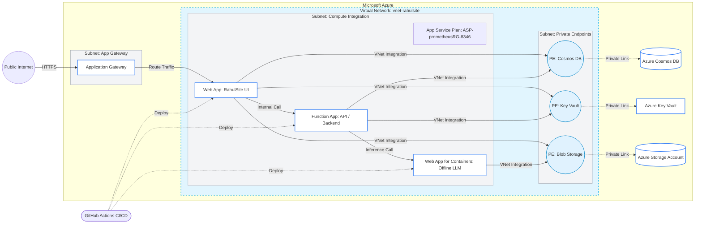

# Azure Infrastructure Low-Level Design (LLD)

## Target Architecture Overview

The target architecture moves RahulSite from a public endpoint model to a secure, private network model within Azure. It uses **VNet Integration** for outbound traffic from compute resources (Web App, Function App, LLM App) and **Private Endpoints** to secure PaaS services (Cosmos DB, Storage, Key Vault). 

To optimize cost, the Web App, Function App, and the LLM Container App (implemented as a Web App for Containers) all share the same App Service Plan.

### Key Components

- **Resource Group:** `Rahulsite`
- **Subscription:** `Rahultest`
- **App Service Plan:** `ASP-prometheusRG-8346 (B1: 1)` (Shared by Web App, Function App, LLM App)
- **Virtual Network:** Manages two primary subnets (`snet-integration`, `snet-endpoints`). Optionally, an `snet-appgw` for Application Gateway ingress.
- **Key Vault:** Stores all application secrets. Accessed via Managed Identity.

## Network Architecture Diagram

## Security & Connectivity Rules

1. **VNet Integration:** Web App, Function App, and LLM Container App must be integrated into `snet-integration`.
2. **Private Endpoints:** PaaS services will have public network access disabled. They are accessed via private IP addresses assigned in `snet-endpoints`.
3. **Internal App Communication:** The Function App and LLM App should be restricted to only accept traffic originating from within the Virtual Network (or via Private Endpoint if scaling up) to prevent direct public access.
4. **Managed Identities:** Web App and Function App will use System Assigned Managed Identities.
5. **Key Vault RBAC:** Access to Key Vault secrets will be granted via Role-Based Access Control (RBAC) to the managed identities.
