# 🏗️ Multi-Cloud Portfolio — System Architecture Blueprint

**Author:** Senior Architect Review  
**Date:** 1 October 2026  
**Status:** Architecture Decision Baseline — Owner Decisions Applied  
**Scope:** 5 projects × 3 clouds × 26 AI concepts

> [!IMPORTANT]
> This document captures **architecture decisions, component designs, data flows, and acceptance criteria** for all six projects. It supersedes the original strategy map and complements the existing Rahul Site LLD. Each section is structured for a development team to pick up and execute.

---

## Table of Contents

1. [Architecture Philosophy](#1-architecture-philosophy)
2. [Global Design Decisions](#2-global-design-decisions)
3. [Project 1 — Rahul Site (Azure)](#3-project-1--rahul-site-azure)
4. [Project 2 — Creator Vault (AWS)](#4-project-2--creator-vault-aws)
5. [Project 3 — Stock Site (GCP)](#5-project-3--stock-site-gcp)
6. [Project 4 — Kids App (GCP Firebase)](#6-project-4--kids-app-gcp-firebase)
7. [Project 5 — Folder Manager (Azure)](#7-project-5--folder-manager-azure)
8. [Cross-Cutting Concerns](#8-cross-cutting-concerns)
9. [Infrastructure Strategy](#9-infrastructure-strategy)
10. [MCP Integration Architecture](#10-mcp-integration-architecture)
11. [Master Build Sequence](#11-master-build-sequence)

---

## 1. Architecture Philosophy

### Core Principles

| Principle | Rationale |
|-----------|-----------|
| **Cloud-Native First** | Each project uses the native services of its target cloud — no abstraction layers that hide cloud-specific learning |
| **Monorepo Infra, Polyrepo Apps** | One `infrastructure-deployments` repo for all Terraform; separate Git repos per application for independent CI/CD |
| **AI as a First-Class Citizen** | Every project teaches specific AI concepts; the AI pipeline is not bolted on but designed into the architecture |
| **Progressive Complexity** | Build order moves from familiar (Azure, existing code) → new territory (AWS serverless) → advanced (GCP multi-agent) |
| **Production-Grade from Day 1** | Security, observability, error handling, and testing are not optional phases — they ship with v1 |
| **MCP as the Universal Glue** | Every project exposes an MCP server, enabling cross-project AI agent interop |

### Technology Alignment Matrix

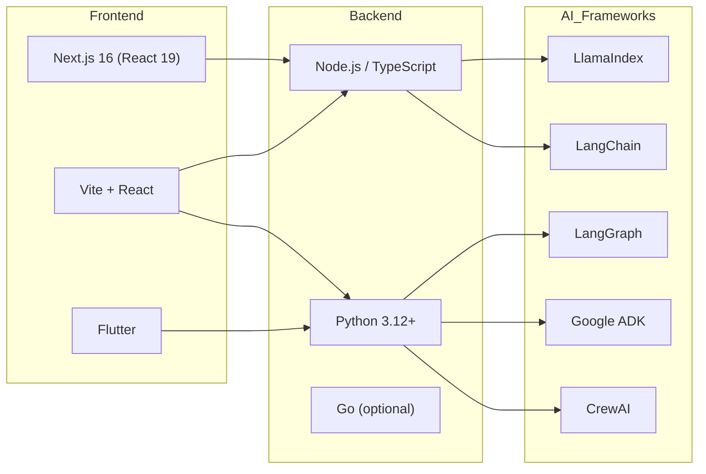
```mermaid
graph LR
    subgraph Frontend
        Next["Next.js 16 (React 19)"]
        Vite["Vite + React"]
        Flutter["Flutter"]
    end

    subgraph Backend
        Node["Node.js / TypeScript"]
        Python["Python 3.12+"]
        Go["Go (optional)"]
    end

    subgraph AI_Frameworks
        LlamaIndex["LlamaIndex"]
        LangChain["LangChain"]
        LangGraph["LangGraph"]
        ADK["Google ADK"]
        CrewAI["CrewAI"]
    end

    Next --> Node
    Vite --> Node
    Vite --> Python
    Flutter --> Python

    Node --> LlamaIndex
    Node --> LangChain
    Python --> LangGraph
    Python --> ADK
    Python --> CrewAI
```

---

## 2. Global Design Decisions

### ADR Index (Global)

| ID | Decision | Resolution | Consequence |
|----|----------|------------|-------------|
| G-ADR-01 | IaC tool | Terraform with cloud-specific providers | Consistent workflow; modules per cloud; state in remote backend per cloud |
| G-ADR-02 | CI/CD | GitHub Actions with OIDC federation per cloud | No static credentials; separate workflows per cloud provider |
| G-ADR-03 | MCP protocol version | MCP v1.0 (2025 spec) | Standardized tool/resource/prompt primitives across all servers |
| G-ADR-04 | Secrets management | Cloud-native vaults (Key Vault / Secrets Manager / Secret Manager) | No `.env` files in production; local dev uses `.env.local` with dummy values |
| G-ADR-05 | Observability | Cloud-native (App Insights / CloudWatch / Cloud Logging) + structured JSON logs | Unified log schema: `{requestId, service, operation, duration, status, error?}` |
| G-ADR-06 | API design | REST for CRUD; WebSocket/SSE for streaming; gRPC reserved for inter-agent comms | Pragmatic choice; AI streaming needs persistent connections |
| G-ADR-07 | Testing baseline | Unit (Vitest/pytest) + Integration + E2E (Playwright) per project | No project ships without passing test gates |
| G-ADR-08 | AI model strategy | Use cloud-native models first (Azure OpenAI, Bedrock, Vertex AI) | Maximizes learning; avoids third-party API key sprawl |
| G-ADR-09 | Monorepo infra state | Remote backends: Azure Storage (Azure projects), S3 (AWS projects), GCS (GCP projects) | State isolation per cloud; no cross-cloud state dependencies |
| G-ADR-10 | Environment strategy | `dev` → `staging` → `prod` per project; feature branches deploy to `dev` | Cost-managed: `dev` is ephemeral; `staging` mirrors prod config |

### Shared Patterns

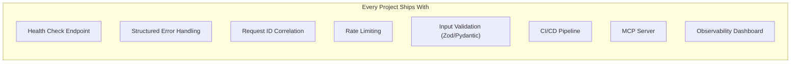
```mermaid
flowchart TB
    subgraph Every_Project["Every Project Ships With"]
        direction TB
        A["Health Check Endpoint"]
        B["Structured Error Handling"]
        C["Request ID Correlation"]
        D["Rate Limiting"]
        E["Input Validation (Zod/Pydantic)"]
        F["CI/CD Pipeline"]
        G["MCP Server"]
        H["Observability Dashboard"]
    end
```

---

## 3. Project 1 — Rahul Site (Azure)

### 3.1 Design Decision Summary

| Decision | Choice | Why |
|----------|--------|-----|
| Framework | **Next.js 16.3.2 / React 19** (existing) | Preserve investment; SSR + ISR for SEO; App Router for streaming |
| Database | **Cosmos DB for MongoDB** (existing) | Already provisioned; Mongoose ORM; free-tier friendly |
| Auth | **NextAuth v4 + Entra ID / Google** (existing) | SSO for admin; JWT sessions; no custom password auth |
| AI Search | **Azure AI Search** (new) | Native hybrid search (vector + keyword); integrates with Azure OpenAI |
| AI Model | **Azure OpenAI GPT-4o + text-embedding-3-large** (new) | RAG pipeline; prompt engineering; same-cloud latency |
| Knowledge Graph | **Cosmos DB Gremlin API** (new, separate account) | Graph queries for cross-document reasoning; stays in Azure |
| Content Safety | **Azure AI Content Safety** (new) | Guardrails for public-facing AI responses |
| RAG Framework | **LlamaIndex (TypeScript)** | Best-in-class for RAG; native Azure integrations |
| CSS | **Tailwind CSS v4** (existing) | Already in project; custom design tokens defined |
| State | **Zustand v5** (existing) | Client-side world preferences; lightweight |
| 3D | **React Three Fiber + Drei** (existing) | Avatar scene; lazy-loaded; graceful fallback |
| Hosting | **Azure App Service B1** (existing) | GitHub Actions OIDC deploy; shared plan |

### 3.2 Component Architecture

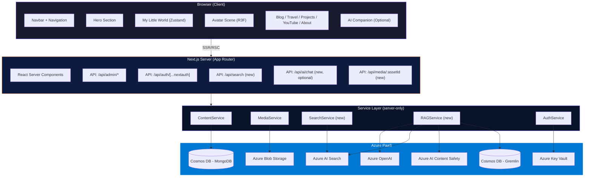
```mermaid
flowchart TB
    subgraph Client["Browser (Client)"]
        direction TB
        NavBar["Navbar + Navigation"]
        Hero["Hero Section"]
        World["My Little World (Zustand)"]
        Scene["Avatar Scene (R3F)"]
        Pages["Blog / Travel / Projects / YouTube / About"]
        AI_Chat["AI Companion (Optional)"]
    end

    subgraph Server["Next.js Server (App Router)"]
        direction TB
        RSC["React Server Components"]
        API_Admin["API: /api/admin/*"]
        API_Auth["API: /api/auth/[...nextauth]"]
        API_Search["API: /api/search (new)"]
        API_AI["API: /api/ai/chat (new, optional)"]
        API_Media["API: /api/media/:assetId (new)"]
    end

    subgraph Services["Service Layer (server-only)"]
        direction TB
        ContentSvc["ContentService"]
        MediaSvc["MediaService"]
        SearchSvc["SearchService (new)"]
        RAGSvc["RAGService (new)"]
        AuthSvc["AuthService"]
    end

    subgraph Azure["Azure PaaS"]
        direction TB
        CosmosDB[(Cosmos DB - MongoDB)]
        CosmosGraph[(Cosmos DB - Gremlin)]
        AISearch["Azure AI Search"]
        OpenAI["Azure OpenAI"]
        BlobStorage["Azure Blob Storage"]
        ContentSafety["Azure AI Content Safety"]
        KeyVault["Azure Key Vault"]
    end

    Client -->|SSR/RSC| Server
    Server --> Services
    ContentSvc --> CosmosDB
    MediaSvc --> BlobStorage
    SearchSvc --> AISearch
    RAGSvc --> OpenAI
    RAGSvc --> AISearch
    RAGSvc --> ContentSafety
    RAGSvc --> CosmosGraph
    AuthSvc --> KeyVault

    style Client fill:#1a1a2e,stroke:#6958ff,color:#fff
    style Server fill:#0d1b3e,stroke:#ff8a3d,color:#fff
    style Services fill:#081229,stroke:#6958ff,color:#fff
    style Azure fill:#0078d4,stroke:#fff,color:#fff
```

### 3.3 RAG Pipeline Design

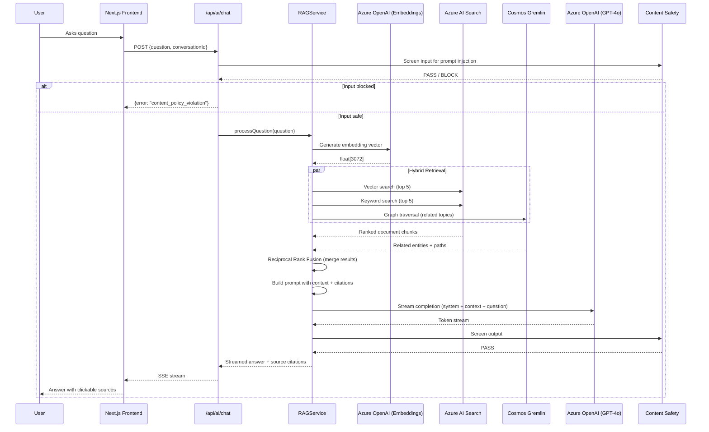
```mermaid
sequenceDiagram
    participant U as User
    participant FE as Next.js Frontend
    participant API as /api/ai/chat
    participant RAG as RAGService
    participant EMB as Azure OpenAI (Embeddings)
    participant SEARCH as Azure AI Search
    participant GRAPH as Cosmos Gremlin
    participant LLM as Azure OpenAI (GPT-4o)
    participant SAFETY as Content Safety

    U->>FE: Asks question
    FE->>API: POST {question, conversationId}
    API->>SAFETY: Screen input for prompt injection
    SAFETY-->>API: PASS / BLOCK
    
    alt Input blocked
        API-->>FE: {error: "content_policy_violation"}
    else Input safe
        API->>RAG: processQuestion(question)
        RAG->>EMB: Generate embedding vector
        EMB-->>RAG: float[3072]
        
        par Hybrid Retrieval
            RAG->>SEARCH: Vector search (top 5)
            RAG->>SEARCH: Keyword search (top 5)
            RAG->>GRAPH: Graph traversal (related topics)
        end
        
        SEARCH-->>RAG: Ranked document chunks
        GRAPH-->>RAG: Related entities + paths
        
        RAG->>RAG: Reciprocal Rank Fusion (merge results)
        RAG->>RAG: Build prompt with context + citations
        
        RAG->>LLM: Stream completion (system + context + question)
        LLM-->>RAG: Token stream
        
        RAG->>SAFETY: Screen output
        SAFETY-->>RAG: PASS
        
        RAG-->>API: Streamed answer + source citations
        API-->>FE: SSE stream
        FE-->>U: Answer with clickable sources
    end
```

### 3.4 Data Model (Evolution from Existing)

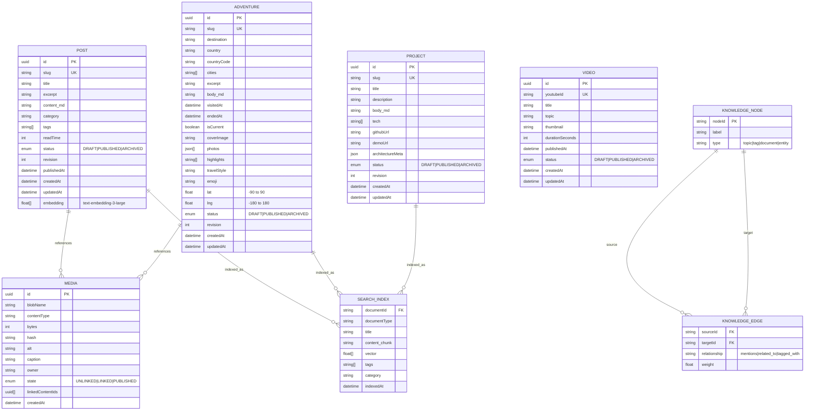
```mermaid
erDiagram
    POST {
        uuid id PK
        string slug UK
        string title
        string excerpt
        string content_md
        string category
        string[] tags
        int readTime
        enum status "DRAFT|PUBLISHED|ARCHIVED"
        int revision
        datetime publishedAt
        datetime createdAt
        datetime updatedAt
        float[] embedding "text-embedding-3-large"
    }

    ADVENTURE {
        uuid id PK
        string slug UK
        string destination
        string country
        string countryCode
        string[] cities
        string excerpt
        string body_md
        datetime visitedAt
        datetime endedAt
        boolean isCurrent
        string coverImage
        json[] photos
        string[] highlights
        string travelStyle
        string emoji
        float lat "-90 to 90"
        float lng "-180 to 180"
        enum status "DRAFT|PUBLISHED|ARCHIVED"
        int revision
        datetime createdAt
        datetime updatedAt
    }

    PROJECT {
        uuid id PK
        string slug UK
        string title
        string description
        string body_md
        string[] tech
        string githubUrl
        string demoUrl
        json architectureMeta
        enum status "DRAFT|PUBLISHED|ARCHIVED"
        int revision
        datetime createdAt
        datetime updatedAt
    }

    VIDEO {
        uuid id PK
        string youtubeId UK
        string title
        string topic
        string thumbnail
        int durationSeconds
        datetime publishedAt
        enum status "DRAFT|PUBLISHED|ARCHIVED"
        datetime createdAt
        datetime updatedAt
    }

    MEDIA {
        uuid id PK
        string blobName
        string contentType
        int bytes
        string hash
        string alt
        string caption
        string owner
        enum state "UNLINKED|LINKED|PUBLISHED"
        uuid[] linkedContentIds
        datetime createdAt
    }

    SEARCH_INDEX {
        string documentId FK
        string documentType
        string title
        string content_chunk
        float[] vector
        string[] tags
        string category
        datetime indexedAt
    }

    KNOWLEDGE_NODE {
        string nodeId PK
        string label
        string type "topic|tag|document|entity"
    }

    KNOWLEDGE_EDGE {
        string sourceId FK
        string targetId FK
        string relationship "mentions|related_to|tagged_with"
        float weight
    }

    POST ||--o{ MEDIA : "references"
    ADVENTURE ||--o{ MEDIA : "references"
    POST ||--o{ SEARCH_INDEX : "indexed_as"
    ADVENTURE ||--o{ SEARCH_INDEX : "indexed_as"
    PROJECT ||--o{ SEARCH_INDEX : "indexed_as"
    KNOWLEDGE_NODE ||--o{ KNOWLEDGE_EDGE : "source"
    KNOWLEDGE_NODE ||--o{ KNOWLEDGE_EDGE : "target"
```

### 3.5 Implementation Phases

| Phase | Scope | Duration | Dependencies |
|-------|-------|----------|-------------|
| **P1: Foundation Fix** | Close G-01 through G-10 gaps from LLD; runtime validation (Zod); real 404s; fixture removal; auth hardening | 2-3 weeks | None |
| **P2: Content Service** | Server-only published content repository; DB reads for public pages; cache invalidation; RSS/sitemap from real data | 1-2 weeks | P1 |
| **P3: Media Pipeline** | Secure upload with byte-signature validation; blob proxy for private container; Media model; linked asset tracking | 1-2 weeks | P1 |
| **P4: Search & Embeddings** | Azure AI Search index; embedding generation on publish; hybrid search API; public search UI | 2 weeks | P2 |
| **P5: RAG Pipeline** | LlamaIndex integration; vector + keyword retrieval; prompt engineering; streaming response; citation formatting | 2-3 weeks | P4 |
| **P6: Knowledge Graph** | Cosmos Gremlin provisioning; auto-extraction of topics/entities on publish; graph-augmented retrieval | 2 weeks | P5 |
| **P7: Guardrails & Eval** | Content Safety integration; prompt injection defense; Ragas evaluation framework; quality metrics dashboard | 1-2 weeks | P5 |
| **P8: MCP Server** | `rahul-knowledge-mcp` exposing search + Q&A tools; MCP test client | 1 week | P5 |
| **P9: Polish & Release** | Performance budgets; accessibility audit; visual refinement; E2E tests; deployment verification | 2 weeks | All |

### 3.6 Acceptance Criteria

> Cross-references existing [need-and-acceptance.md](file:///Users/rtripathi/Rahul%20Project/rahultech%20site/rahultech-web/design/need-and-acceptance.md) IDs.

| ID | Criterion | Verification Method |
|----|-----------|-------------------|
| RS-AI-01 | RAG answers cite at least one published source document for factual claims | Automated eval: 50-question test set; faithfulness score ≥ 0.85 (Ragas) |
| RS-AI-02 | AI never invents biography, destinations, dates, or metrics about Rahul | Adversarial prompt test suite (20 attack prompts); zero fabrication tolerance |
| RS-AI-03 | Prompt injection attempts are blocked before reaching LLM | Injection test corpus (OWASP LLM Top 10); Content Safety blocks ≥ 95% |
| RS-AI-04 | AI response latency p95 ≤ 5s for a 200-token answer | Load test: 10 concurrent users, 100 queries; measured with App Insights |
| RS-AI-05 | Embedding generation completes within 30s of publish action | Integration test: publish → verify AI Search index updated |
| RS-AI-06 | MCP server responds to `search` and `ask` tools correctly | MCP test client: 10 tool calls; all return valid JSON per MCP spec |
| RS-AI-07 | Knowledge graph has ≥ 3 relationship types traversable | Graph query test: topic→document, document→tag, tag→related_topic |
| RS-SEARCH-01 | Hybrid search returns relevant results for natural language queries | Precision@5 ≥ 0.7 on 30-query evaluation set |
| RS-SEARCH-02 | Search works when AI services are unavailable (keyword fallback) | Kill Azure OpenAI endpoint → search still returns keyword results |
| RS-PERF-01 | LCP ≤ 2.5s mobile p75; CLS ≤ 0.1; INP ≤ 200ms | Lighthouse CI in pipeline; field data when traffic sufficient |
| RS-SEC-01 | No admin API accessible without valid session | Automated: hit all `/api/admin/*` routes without auth → 401 |
| RS-SEC-02 | AI conversations are not logged with full prompt content | Log audit: verify requestId + truncated query only |

---

## 4. Project 2 — Creator Vault (AWS)

### 4.1 Design Decision Summary

| Decision | Choice | Why |
|----------|--------|-----|
| Frontend | **Vite + React 19 + TypeScript** | Lighter than Next.js; SPA is fine — no SEO needed for private vault |
| Backend | **Python 3.12 (FastAPI)** | Best ecosystem for media processing; native AWS SDK; LangChain/LangGraph support |
| Orchestration | **AWS Step Functions** | Visual workflow; built-in retry/error handling; native Lambda integration |
| Compute | **Lambda (API) + ECS Fargate (heavy processing)** | Lambda for API handlers; Fargate for yt-dlp (needs long runtime + disk) |
| Database | **DynamoDB** | Serverless; pay-per-use; flexible schema for metadata + conversations |
| Storage | **S3** | Video/audio storage; lifecycle policies for cost management |
| AI - Transcription | **Amazon Transcribe** | Native AWS; supports 100+ languages; speaker diarization |
| AI - LLM | **Amazon Bedrock (Claude 4 / Llama)** | Managed models; no GPU infrastructure; tool_use API for function calling |
| AI Framework | **LangChain + LangGraph** | Tool-calling chains; stateful multi-step workflows with checkpoints |
| Auth | **Amazon Cognito** | Native AWS auth; OAuth 2.0; user pools for multi-user support |
| CDN | **CloudFront** | Secure signed URLs for media delivery |

### 4.2 System Architecture

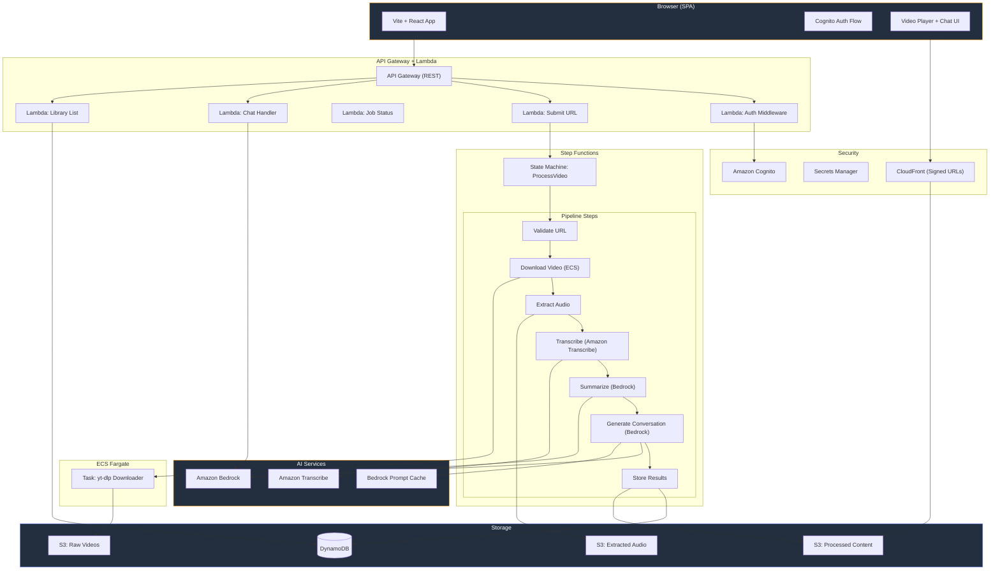
```mermaid
flowchart TB
    subgraph Client["Browser (SPA)"]
        UI["Vite + React App"]
        Auth_UI["Cognito Auth Flow"]
        Player["Video Player + Chat UI"]
    end

    subgraph API_Layer["API Gateway + Lambda"]
        GW["API Gateway (REST)"]
        LambdaAuth["Lambda: Auth Middleware"]
        LambdaSubmit["Lambda: Submit URL"]
        LambdaStatus["Lambda: Job Status"]
        LambdaChat["Lambda: Chat Handler"]
        LambdaList["Lambda: Library List"]
    end

    subgraph Orchestration["Step Functions"]
        SF["State Machine: ProcessVideo"]
        
        subgraph Steps["Pipeline Steps"]
            S1["Validate URL"]
            S2["Download Video (ECS)"]
            S3["Extract Audio"]
            S4["Transcribe (Amazon Transcribe)"]
            S5["Summarize (Bedrock)"]
            S6["Generate Conversation (Bedrock)"]
            S7["Store Results"]
        end
    end

    subgraph Compute["ECS Fargate"]
        ECS["Task: yt-dlp Downloader"]
    end

    subgraph AI["AI Services"]
        Transcribe["Amazon Transcribe"]
        Bedrock["Amazon Bedrock"]
        BedrockCache["Bedrock Prompt Cache"]
    end

    subgraph Storage_Layer["Storage"]
        S3_Raw["S3: Raw Videos"]
        S3_Audio["S3: Extracted Audio"]
        S3_Processed["S3: Processed Content"]
        DDB[(DynamoDB)]
    end

    subgraph Security["Security"]
        Cognito["Amazon Cognito"]
        SecretsM["Secrets Manager"]
        CloudFront["CloudFront (Signed URLs)"]
    end

    Client --> GW
    GW --> LambdaAuth --> Cognito
    GW --> LambdaSubmit --> SF
    GW --> LambdaChat --> Bedrock
    GW --> LambdaList --> DDB

    SF --> S1 --> S2 --> S3 --> S4 --> S5 --> S6 --> S7
    S2 --> ECS --> S3_Raw
    S3 --> S3_Audio
    S4 --> Transcribe
    S5 --> Bedrock
    S6 --> Bedrock
    S6 --> BedrockCache
    S7 --> DDB
    S7 --> S3_Processed

    Player --> CloudFront --> S3_Processed

    style Client fill:#232f3e,stroke:#ff9900,color:#fff
    style AI fill:#232f3e,stroke:#ff9900,color:#fff
    style Storage_Layer fill:#232f3e,stroke:#527fff,color:#fff
```

### 4.3 Step Functions State Machine

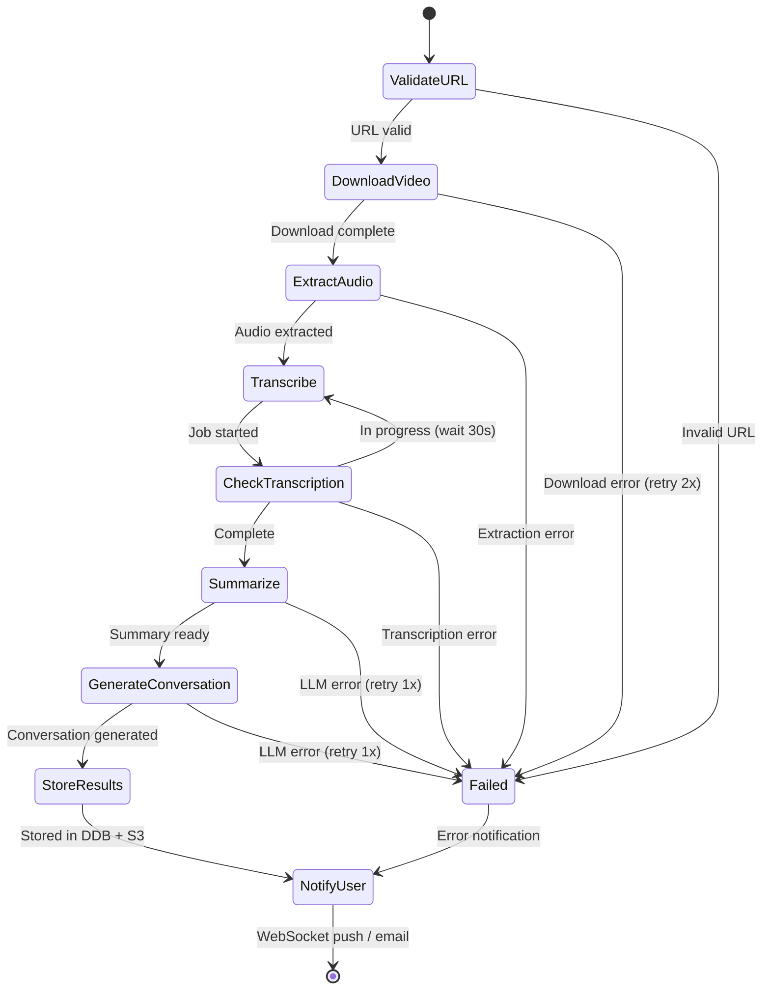
```mermaid
stateDiagram-v2
    [*] --> ValidateURL
    ValidateURL --> DownloadVideo: URL valid
    ValidateURL --> Failed: Invalid URL

    DownloadVideo --> ExtractAudio: Download complete
    DownloadVideo --> Failed: Download error (retry 2x)

    ExtractAudio --> Transcribe: Audio extracted
    ExtractAudio --> Failed: Extraction error

    Transcribe --> CheckTranscription: Job started
    CheckTranscription --> Transcribe: In progress (wait 30s)
    CheckTranscription --> Summarize: Complete
    CheckTranscription --> Failed: Transcription error

    Summarize --> GenerateConversation: Summary ready
    Summarize --> Failed: LLM error (retry 1x)

    GenerateConversation --> StoreResults: Conversation generated
    GenerateConversation --> Failed: LLM error (retry 1x)

    StoreResults --> NotifyUser: Stored in DDB + S3
    NotifyUser --> [*]: WebSocket push / email

    Failed --> NotifyUser: Error notification
```

### 4.4 Data Model

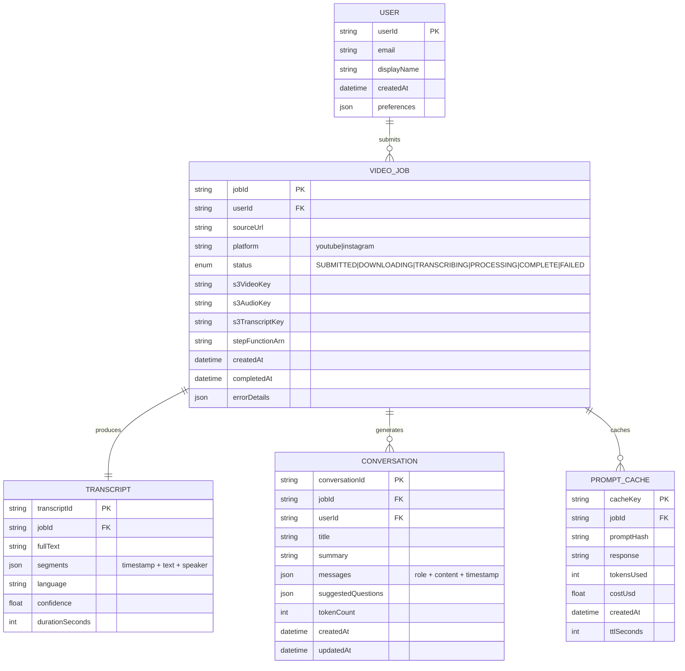
```mermaid
erDiagram
    USER {
        string userId PK
        string email
        string displayName
        datetime createdAt
        json preferences
    }

    VIDEO_JOB {
        string jobId PK
        string userId FK
        string sourceUrl
        string platform "youtube|instagram"
        enum status "SUBMITTED|DOWNLOADING|TRANSCRIBING|PROCESSING|COMPLETE|FAILED"
        string s3VideoKey
        string s3AudioKey
        string s3TranscriptKey
        string stepFunctionArn
        datetime createdAt
        datetime completedAt
        json errorDetails
    }

    TRANSCRIPT {
        string transcriptId PK
        string jobId FK
        string fullText
        json segments "timestamp + text + speaker"
        string language
        float confidence
        int durationSeconds
    }

    CONVERSATION {
        string conversationId PK
        string jobId FK
        string userId FK
        string title
        string summary
        json messages "role + content + timestamp"
        json suggestedQuestions
        int tokenCount
        datetime createdAt
        datetime updatedAt
    }

    PROMPT_CACHE {
        string cacheKey PK
        string jobId FK
        string promptHash
        string response
        int tokensUsed
        float costUsd
        datetime createdAt
        int ttlSeconds
    }

    USER ||--o{ VIDEO_JOB : "submits"
    VIDEO_JOB ||--|| TRANSCRIPT : "produces"
    VIDEO_JOB ||--o{ CONVERSATION : "generates"
    VIDEO_JOB ||--o{ PROMPT_CACHE : "caches"
```

### 4.5 Implementation Phases

| Phase | Scope | Duration |
|-------|-------|----------|
| **P1: AWS Foundation** | Terraform modules (VPC, Lambda, S3, DynamoDB, API Gateway); Cognito user pool; basic CRUD API | 2 weeks |
| **P2: Download Pipeline** | ECS Fargate task for yt-dlp; S3 lifecycle policies; Step Functions skeleton | 2 weeks |
| **P3: Transcription** | Amazon Transcribe integration; async job polling; transcript storage; segment parsing | 1-2 weeks |
| **P4: LLM Processing** | Bedrock Claude integration; summarization prompt; conversation generation; prompt caching | 2-3 weeks |
| **P5: Chat Interface** | React chat UI; WebSocket streaming; conversation history; suggested questions | 2 weeks |
| **P6: Agentic Workflows** | LangChain tool-calling chains; LangGraph stateful workflow with checkpoints | 2 weeks |
| **P7: MCP Server** | `creatorvault-mcp` exposing transcript search + video summary tools | 1 week |
| **P8: Polish** | CloudFront delivery; cost monitoring; error handling; E2E tests | 2 weeks |

### 4.6 Acceptance Criteria

| ID | Criterion | Verification |
|----|-----------|-------------|
| CV-CORE-01 | User can paste a YouTube URL and receive a processed transcript within 10 minutes for a 30-min video | E2E test: 5 videos of varying length; all complete within SLA |
| CV-CORE-02 | Transcription accuracy ≥ 90% WER for English content | Compare against manual transcription of 3 test videos |
| CV-CORE-03 | Generated conversation is coherent and covers key topics from the video | Human evaluation: 3 reviewers rate quality ≥ 4/5 |
| CV-AI-01 | Function calling correctly selects tools based on user intent | 20-query tool-selection test; accuracy ≥ 95% |
| CV-AI-02 | Prompt caching reduces LLM cost by ≥ 40% for repeated queries on same video | Cost comparison: cached vs uncached for 50 queries |
| CV-AI-03 | Streaming response delivers first token within 2s | p95 latency measurement across 50 chat messages |
| CV-SEC-01 | Unauthenticated requests to any API endpoint return 401 | Automated: hit all endpoints without Cognito token |
| CV-SEC-02 | Downloaded videos are virus-scanned before processing | S3 event → Lambda scan → quarantine if detected |
| CV-SCALE-01 | System handles 10 concurrent video processing jobs | Load test with Step Functions concurrency |
| CV-COST-01 | Per-video processing cost ≤ $0.50 for a 30-minute video | Cost tracking dashboard in CloudWatch |

---

## 5. Project 3 — Stock Site (GCP)

### 5.1 Design Decision Summary

| Decision | Choice | Why |
|----------|--------|-----|
| Frontend | **Next.js 16 (deployed on Cloud Run)** | SSR for SEO (public market pages); streaming for real-time data |
| Backend | **Python 3.12 (FastAPI)** | Best ecosystem for quantitative finance; NumPy/Pandas; ML libraries |
| Agent Framework | **Google ADK (primary) + CrewAI (prototyping)** | ADK is native GCP; CrewAI for rapid multi-agent iteration |
| Stateful Agents | **LangGraph** | Complex stateful workflows with human-in-the-loop approvals |
| Database | **Firestore** | Real-time listeners for portfolio updates; serverless |
| Analytics DB | **BigQuery** | Historical market data analysis; ML training data storage |
| Message Bus | **Cloud Pub/Sub** | Real-time market data fan-out; agent communication backbone |
| AI Model | **Vertex AI (Gemini 2.5 Pro / Flash)** | Native function calling; fine-tuning support; evaluation service |
| Fine-tuning | **Vertex AI Fine-Tuning** | Gemma models on historical data; reward-based RLHF |
| Knowledge Graph | **Neo4j on GCP (Cloud Marketplace)** | Company relationships; supply chains; sector correlations |
| Real-time Data | **Cloud Run + Pub/Sub** | WebSocket connections to broker APIs; fan-out to agents |
| **Broker** | **Zerodha Kite Connect API** | India's largest discount broker; REST + WebSocket APIs; ₹2000/month for market data; paper trading via Kite sandbox |

### 5.2 Multi-Agent Architecture

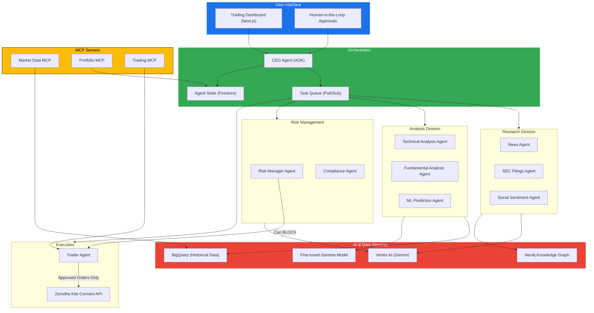
```mermaid
flowchart TB
    subgraph User_Layer["User Interface"]
        Dashboard["Trading Dashboard (Next.js)"]
        Approvals["Human-in-the-Loop Approvals"]
    end

    subgraph Orchestrator_Layer["Orchestrator"]
        Orchestrator["CEO Agent (ADK)"]
        TaskQueue["Task Queue (Pub/Sub)"]
        StateStore["Agent State (Firestore)"]
    end

    subgraph Research_Team["Research Division"]
        NewsAgent["News Agent"]
        SECAgent["SEC Filings Agent"]
        SentimentAgent["Social Sentiment Agent"]
    end

    subgraph Analysis_Team["Analysis Division"]
        TechnicalAgent["Technical Analysis Agent"]
        FundamentalAgent["Fundamental Analysis Agent"]
        MLAgent["ML Prediction Agent"]
    end

    subgraph Risk_Team["Risk Management"]
        RiskAgent["Risk Manager Agent"]
        ComplianceAgent["Compliance Agent"]
    end

    subgraph Execution_Team["Execution"]
        TraderAgent["Trader Agent"]
        BrokerAPI["Zerodha Kite Connect API"]
    end

    subgraph AI_Services["AI & Data Services"]
        VertexAI["Vertex AI (Gemini)"]
        BigQuery["BigQuery (Historical Data)"]
        Neo4j["Neo4j Knowledge Graph"]
        FineTuned["Fine-tuned Gemma Model"]
    end

    subgraph MCP_Servers["MCP Servers"]
        MarketMCP["Market Data MCP"]
        PortfolioMCP["Portfolio MCP"]
        TradingMCP["Trading MCP"]
    end

    Dashboard --> Orchestrator
    Approvals --> Orchestrator
    
    Orchestrator --> TaskQueue
    Orchestrator --> StateStore
    
    TaskQueue --> Research_Team
    TaskQueue --> Analysis_Team
    TaskQueue --> Risk_Team
    TaskQueue --> Execution_Team

    Research_Team --> VertexAI
    Research_Team --> Neo4j
    Analysis_Team --> BigQuery
    Analysis_Team --> FineTuned
    Risk_Team --> VertexAI
    
    TraderAgent -->|"Approved Orders Only"| BrokerAPI
    RiskAgent -->|"Can BLOCK"| TraderAgent

    MarketMCP --> BigQuery
    PortfolioMCP --> StateStore
    TradingMCP --> TraderAgent

    style User_Layer fill:#1a73e8,stroke:#fff,color:#fff
    style Orchestrator_Layer fill:#34a853,stroke:#fff,color:#fff
    style AI_Services fill:#ea4335,stroke:#fff,color:#fff
    style MCP_Servers fill:#fbbc04,stroke:#000,color:#000
```

### 5.3 A2A Protocol Flow

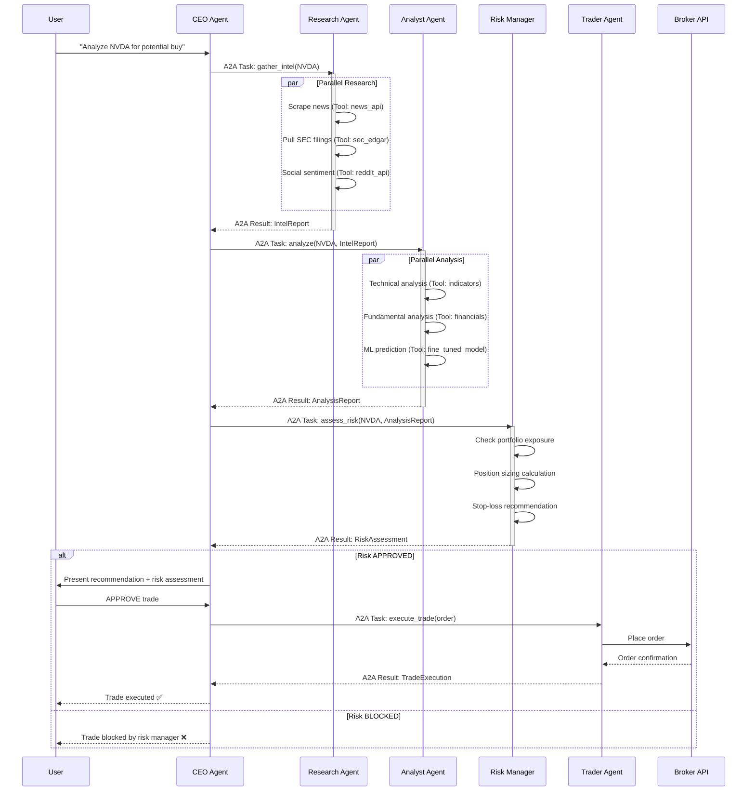
```mermaid
sequenceDiagram
    participant User
    participant Orchestrator as CEO Agent
    participant Research as Research Agent
    participant Analyst as Analyst Agent
    participant Risk as Risk Manager
    participant Trader as Trader Agent
    participant Broker as Broker API

    User->>Orchestrator: "Analyze NVDA for potential buy"
    
    Orchestrator->>Research: A2A Task: gather_intel(NVDA)
    activate Research
    
    par Parallel Research
        Research->>Research: Scrape news (Tool: news_api)
        Research->>Research: Pull SEC filings (Tool: sec_edgar)
        Research->>Research: Social sentiment (Tool: reddit_api)
    end
    
    Research-->>Orchestrator: A2A Result: IntelReport
    deactivate Research

    Orchestrator->>Analyst: A2A Task: analyze(NVDA, IntelReport)
    activate Analyst
    
    par Parallel Analysis
        Analyst->>Analyst: Technical analysis (Tool: indicators)
        Analyst->>Analyst: Fundamental analysis (Tool: financials)
        Analyst->>Analyst: ML prediction (Tool: fine_tuned_model)
    end
    
    Analyst-->>Orchestrator: A2A Result: AnalysisReport
    deactivate Analyst

    Orchestrator->>Risk: A2A Task: assess_risk(NVDA, AnalysisReport)
    activate Risk
    Risk->>Risk: Check portfolio exposure
    Risk->>Risk: Position sizing calculation
    Risk->>Risk: Stop-loss recommendation
    Risk-->>Orchestrator: A2A Result: RiskAssessment
    deactivate Risk

    alt Risk APPROVED
        Orchestrator->>User: Present recommendation + risk assessment
        User->>Orchestrator: APPROVE trade
        Orchestrator->>Trader: A2A Task: execute_trade(order)
        Trader->>Broker: Place order
        Broker-->>Trader: Order confirmation
        Trader-->>Orchestrator: A2A Result: TradeExecution
        Orchestrator-->>User: Trade executed ✅
    else Risk BLOCKED
        Orchestrator-->>User: Trade blocked by risk manager ❌
    end
```

### 5.4 RLHF Training Pipeline

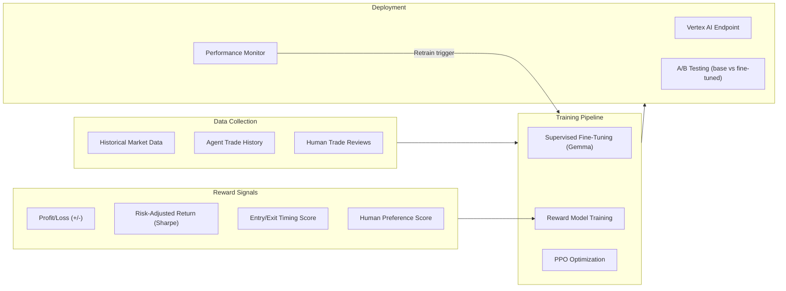
```mermaid
flowchart LR
    subgraph Data_Collection["Data Collection"]
        HistData["Historical Market Data"]
        TradeLog["Agent Trade History"]
        HumanFeedback["Human Trade Reviews"]
    end

    subgraph Training["Training Pipeline"]
        direction TB
        SFT["Supervised Fine-Tuning (Gemma)"]
        RewardModel["Reward Model Training"]
        PPO["PPO Optimization"]
    end

    subgraph Reward_Signals["Reward Signals"]
        Profit["Profit/Loss (+/-) "]
        RiskAdj["Risk-Adjusted Return (Sharpe)"]
        Timing["Entry/Exit Timing Score"]
        HumanPref["Human Preference Score"]
    end

    subgraph Deployment["Deployment"]
        VertexDeploy["Vertex AI Endpoint"]
        ABTest["A/B Testing (base vs fine-tuned)"]
        Monitor["Performance Monitor"]
    end

    Data_Collection --> Training
    Reward_Signals --> RewardModel
    Training --> Deployment
    Monitor -->|Retrain trigger| Training
```

### 5.5 Implementation Phases

| Phase | Scope | Duration |
|-------|-------|----------|
| **P1: GCP Foundation** | Terraform modules; Cloud Run; Firestore; Pub/Sub; IAM; basic dashboard UI | 2-3 weeks |
| **P2: Market Data Pipeline** | Real-time data ingestion via Pub/Sub; BigQuery historical data load; data normalization | 2 weeks |
| **P3: Single Agent** | Research Agent with ADK; function calling for news/SEC/sentiment APIs | 2-3 weeks |
| **P4: Multi-Agent Orchestration** | CEO + Analyst + Risk agents; A2A protocol; task routing; state management | 3-4 weeks |
| **P5: Trading Execution** | Broker API integration (paper trading first); order management; P&L tracking | 2-3 weeks |
| **P6: Knowledge Graph** | Neo4j deployment; company/sector relationship mapping; graph-augmented analysis | 2 weeks |
| **P7: Fine-tuning & RLHF** | Gemma fine-tuning on historical data; reward model; PPO optimization; A/B testing | 4-6 weeks |
| **P8: MCP Servers (x3)** | Market Data, Portfolio, Trading MCP servers; test clients | 2 weeks |
| **P9: Dashboard & Polish** | Real-time dashboard; alerting; E2E tests; paper trading validation | 3 weeks |

### 5.6 Acceptance Criteria

| ID | Criterion | Verification |
|----|-----------|-------------|
| SS-AGENT-01 | Orchestrator correctly delegates tasks to ≥ 3 specialized agents | E2E trace: verify A2A message flow for 10 analysis requests |
| SS-AGENT-02 | Agents communicate via A2A protocol with proper task/result envelopes | Protocol conformance test against A2A spec |
| SS-AGENT-03 | Risk Manager can block trade execution (hard guardrail) | Test: submit order exceeding position limit → blocked |
| SS-AI-01 | Fine-tuned model outperforms base model on backtested returns by ≥ 5% | 6-month backtest comparison; statistical significance test |
| SS-AI-02 | RLHF-trained model shows improved Sharpe ratio vs supervised-only | A/B test over 1000 simulated trades |
| SS-AI-03 | Function calling selects correct tools ≥ 98% of the time | 100-query automated evaluation |
| SS-RT-01 | Market data updates reflected in dashboard within 2s | WebSocket latency measurement; 1000 data points |
| SS-RT-02 | Agent decision pipeline completes within 30s for a single stock analysis | p95 latency across 50 analysis requests |
| SS-SEC-01 | Paper trading mode cannot execute real orders | Integration test: verify Zerodha Kite sandbox mode; no live orders |
| SS-SEC-02 | All agent decisions are logged with full reasoning chain | Audit log review: 100% of trade decisions have reasoning |
| SS-MCP-01 | All 3 MCP servers respond correctly to their tool definitions | MCP test client: full tool coverage test |

---

## 6. Project 4 — Kids App (GCP Firebase)

### 6.1 Design Decision Summary

| Decision | Choice | Why |
|----------|--------|-----|
| Client | **Flutter (iOS + Android + Web)** | Fastest cross-platform framework; compiled to native ARM code; 120fps animations; Impeller rendering engine eliminates shader jank — critical for kids' attention span |
| Backend | **Firebase (Firestore + Auth + Cloud Functions + Hosting)** | Serverless; real-time sync; easy auth; Spark plan (free) covers development + early users |
| AI Model | **Gemini API (via Firebase Extensions or direct)** | Content generation; adaptive difficulty; safety filters built-in |
| On-device ML | **TensorFlow Lite + Firebase ML** | Offline capabilities; drawing recognition; privacy for kids |
| Speech | **Google Cloud Text-to-Speech** | Read questions aloud; multiple voices; SSML support |
| Vision | **Google Cloud Vision API** | Object recognition for interactive learning |
| Content Safety | **Gemini Safety Settings (BLOCK_LOW_AND_ABOVE) + Custom filters** | COPPA compliance; age-appropriate content only |
| Analytics | **Firebase Analytics (with consent)** | Learning progress tracking; no PII collection |

### 6.2 System Architecture

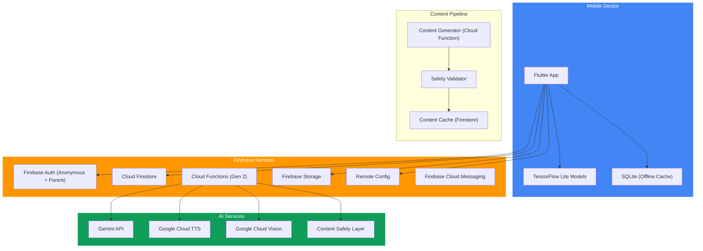
```mermaid
flowchart TB
    subgraph Device["Mobile Device"]
        FlutterApp["Flutter App"]
        TFLite["TensorFlow Lite Models"]
        LocalDB["SQLite (Offline Cache)"]
        
        FlutterApp --> TFLite
        FlutterApp --> LocalDB
    end

    subgraph Firebase["Firebase Services"]
        Auth["Firebase Auth (Anonymous + Parent)"]
        Firestore["Cloud Firestore"]
        Functions["Cloud Functions (Gen 2)"]
        Storage_FB["Firebase Storage"]
        RemoteConfig["Remote Config"]
        FCM["Firebase Cloud Messaging"]
    end

    subgraph AI["AI Services"]
        Gemini["Gemini API"]
        TTS["Google Cloud TTS"]
        Vision["Google Cloud Vision"]
        SafetyFilter["Content Safety Layer"]
    end

    subgraph Content["Content Pipeline"]
        direction TB
        Generator["Content Generator (Cloud Function)"]
        Validator["Safety Validator"]
        Cache["Content Cache (Firestore)"]
    end

    FlutterApp --> Auth
    FlutterApp --> Firestore
    FlutterApp --> Storage_FB
    FlutterApp --> RemoteConfig

    Functions --> Gemini
    Functions --> TTS
    Functions --> Vision
    Functions --> SafetyFilter

    Generator --> Validator --> Cache

    style Device fill:#4285f4,stroke:#fff,color:#fff
    style Firebase fill:#ff9800,stroke:#fff,color:#fff
    style AI fill:#0f9d58,stroke:#fff,color:#fff
```

### 6.3 Adaptive Learning Algorithm

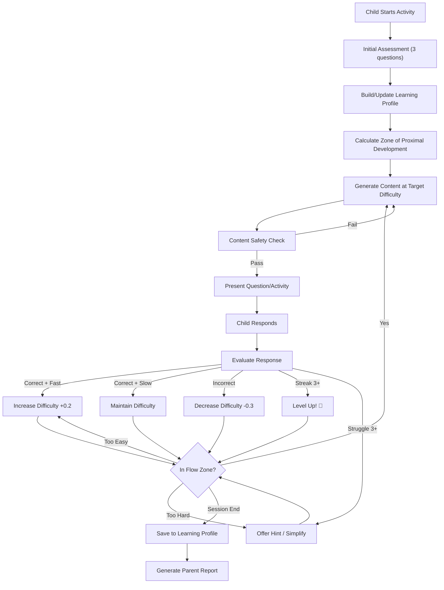
```mermaid
flowchart TB
    Start["Child Starts Activity"] --> Assess["Initial Assessment (3 questions)"]
    Assess --> Profile["Build/Update Learning Profile"]
    
    Profile --> ZPD["Calculate Zone of Proximal Development"]
    
    ZPD --> Generate["Generate Content at Target Difficulty"]
    Generate --> Safety["Content Safety Check"]
    
    Safety -->|Pass| Present["Present Question/Activity"]
    Safety -->|Fail| Generate
    
    Present --> Response["Child Responds"]
    
    Response --> Evaluate["Evaluate Response"]
    
    Evaluate -->|Correct + Fast| IncreaseDiff["Increase Difficulty +0.2"]
    Evaluate -->|Correct + Slow| MaintainDiff["Maintain Difficulty"]
    Evaluate -->|Incorrect| DecreaseDiff["Decrease Difficulty -0.3"]
    Evaluate -->|Streak 3+| LevelUp["Level Up! 🎉"]
    Evaluate -->|Struggle 3+| Hint["Offer Hint / Simplify"]
    
    IncreaseDiff --> FlowCheck
    MaintainDiff --> FlowCheck
    DecreaseDiff --> FlowCheck
    LevelUp --> FlowCheck
    Hint --> FlowCheck
    
    FlowCheck{"In Flow Zone?"}
    FlowCheck -->|Yes| Generate
    FlowCheck -->|Too Easy| IncreaseDiff
    FlowCheck -->|Too Hard| Hint
    FlowCheck -->|Session End| SaveProgress["Save to Learning Profile"]
    
    SaveProgress --> ParentReport["Generate Parent Report"]
```

### 6.4 Data Model

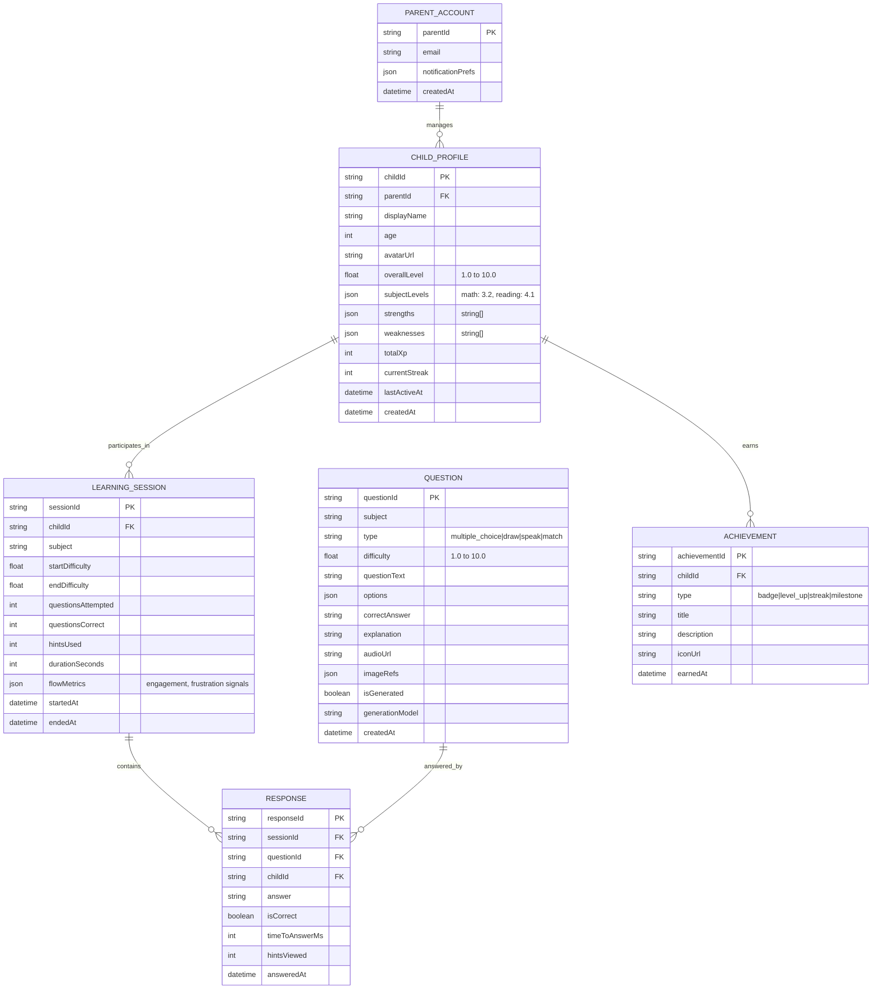
```mermaid
erDiagram
    CHILD_PROFILE {
        string childId PK
        string parentId FK
        string displayName
        int age
        string avatarUrl
        float overallLevel "1.0 to 10.0"
        json subjectLevels "math: 3.2, reading: 4.1"
        json strengths "string[]"
        json weaknesses "string[]"
        int totalXp
        int currentStreak
        datetime lastActiveAt
        datetime createdAt
    }

    LEARNING_SESSION {
        string sessionId PK
        string childId FK
        string subject
        float startDifficulty
        float endDifficulty
        int questionsAttempted
        int questionsCorrect
        int hintsUsed
        int durationSeconds
        json flowMetrics "engagement, frustration signals"
        datetime startedAt
        datetime endedAt
    }

    QUESTION {
        string questionId PK
        string subject
        string type "multiple_choice|draw|speak|match"
        float difficulty "1.0 to 10.0"
        string questionText
        json options
        string correctAnswer
        string explanation
        string audioUrl
        json imageRefs
        boolean isGenerated
        string generationModel
        datetime createdAt
    }

    RESPONSE {
        string responseId PK
        string sessionId FK
        string questionId FK
        string childId FK
        string answer
        boolean isCorrect
        int timeToAnswerMs
        int hintsViewed
        datetime answeredAt
    }

    ACHIEVEMENT {
        string achievementId PK
        string childId FK
        string type "badge|level_up|streak|milestone"
        string title
        string description
        string iconUrl
        datetime earnedAt
    }

    PARENT_ACCOUNT {
        string parentId PK
        string email
        json notificationPrefs
        datetime createdAt
    }

    PARENT_ACCOUNT ||--o{ CHILD_PROFILE : "manages"
    CHILD_PROFILE ||--o{ LEARNING_SESSION : "participates_in"
    LEARNING_SESSION ||--o{ RESPONSE : "contains"
    QUESTION ||--o{ RESPONSE : "answered_by"
    CHILD_PROFILE ||--o{ ACHIEVEMENT : "earns"
```

### 6.5 Implementation Phases

| Phase | Scope | Duration |
|-------|-------|----------|
| **P1: Flutter Foundation** | App scaffold; Firebase setup; auth (anonymous + parent); Firestore schema; basic UI | 2-3 weeks |
| **P2: Core Learning Engine** | Adaptive difficulty algorithm; question presentation; response evaluation; flow zone detection | 3 weeks |
| **P3: Content Generation** | Gemini-powered question generation; safety filtering; content caching; multiple subjects | 2-3 weeks |
| **P4: Voice & Vision** | TTS for questions; speech recognition for answers; camera-based drawing recognition | 2 weeks |
| **P5: Edge AI** | TFLite models for offline drawing/object recognition; offline mode with cached content | 3 weeks |
| **P6: Gamification** | XP system; achievements; streaks; avatars; parent dashboard with progress reports | 2 weeks |
| **P7: Safety & Compliance** | COPPA compliance review; content safety hardening; parental controls; data minimization | 2 weeks |
| **P8: Polish** | Animations; sound effects; performance optimization; accessibility for kids with disabilities | 2 weeks |

### 6.6 Acceptance Criteria

| ID | Criterion | Verification |
|----|-----------|-------------|
| KA-LEARN-01 | Adaptive algorithm adjusts difficulty within 3 questions of skill mismatch | Simulation: 100 synthetic learner profiles; verify convergence |
| KA-LEARN-02 | Children stay in "flow zone" ≥ 70% of session time | A/B test: adaptive vs fixed difficulty; measure engagement metrics |
| KA-LEARN-03 | Generated questions are age-appropriate and factually correct | Human review: 200 generated questions rated by educators |
| KA-SAFETY-01 | Zero inappropriate content reaches children | Adversarial content generation test (1000 prompts); Content Safety blocks 100% |
| KA-SAFETY-02 | App collects zero PII from children without parental consent | Privacy audit; network traffic inspection; Firestore schema review |
| KA-EDGE-01 | Core learning activities work fully offline | Airplane mode test: complete 10-question session without network |
| KA-EDGE-02 | TFLite drawing recognition accuracy ≥ 85% for target categories | Test with 500 child-like drawings across 20 categories |
| KA-VOICE-01 | TTS reads questions clearly and at appropriate speed for age group | User test: 10 children ages 4-8; comprehension ≥ 90% |
| KA-PERF-01 | App cold start ≤ 3s on mid-range Android device | Benchmark on Pixel 6a equivalent |
| KA-GAME-01 | Gamification increases session duration by ≥ 20% | A/B test: gamified vs non-gamified; 100 sessions each |

---

## 7. Project 5 — Folder Manager (Azure)

### 7.1 Design Decision Summary

| Decision | Choice | Why |
|----------|--------|-----|
| Frontend | **Next.js 16 (React 19)** | Consistent with Rahul Site; SSR for shared links; file preview rendering |
| Backend | **Next.js API Routes + Azure Functions** | API routes for CRUD; Functions for async processing (OCR, embedding) |
| Database | **Cosmos DB for MongoDB** (shared account, separate DB) | Reuse existing Azure Cosmos; cost-efficient |
| Storage | **Azure Blob Storage** | Already hosting files; tiered storage for cost optimization |
| AI - OCR | **Azure AI Document Intelligence** | PDF/image text extraction; table/form recognition; handwriting |
| AI - Search | **Azure AI Search** | Same as Rahul Site; vector + keyword hybrid |
| AI - Embeddings | **Azure OpenAI text-embedding-3-large** | Consistent embedding model across Azure projects |
| AI - Summarization | **Azure OpenAI GPT-4o** | Auto-summaries; auto-classification; natural language answers |
| Auth | **NextAuth + Entra ID** | Enterprise-ready; same-cloud SSO; multi-user support |

### 7.2 System Architecture

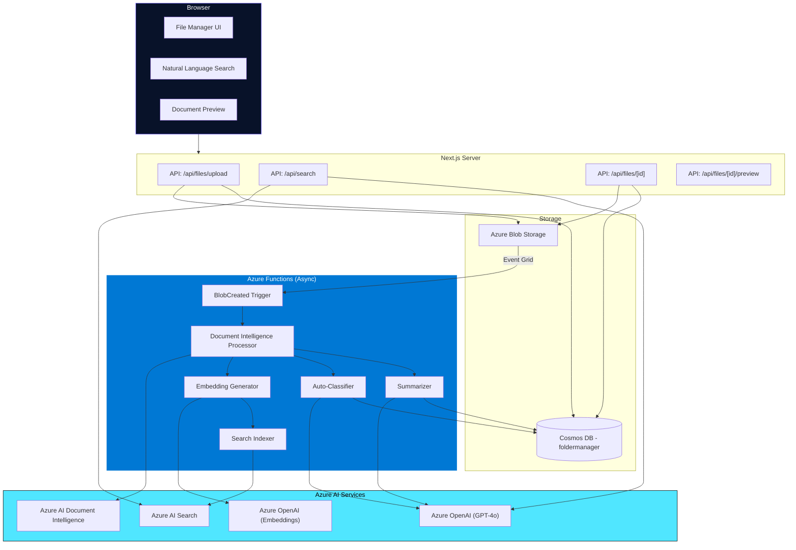
```mermaid
flowchart TB
    subgraph Client["Browser"]
        FileUI["File Manager UI"]
        SearchUI["Natural Language Search"]
        PreviewUI["Document Preview"]
    end

    subgraph Server["Next.js Server"]
        UploadAPI["API: /api/files/upload"]
        SearchAPI["API: /api/search"]
        FileAPI["API: /api/files/[id]"]
        PreviewAPI["API: /api/files/[id]/preview"]
    end

    subgraph AsyncPipeline["Azure Functions (Async)"]
        BlobTrigger["BlobCreated Trigger"]
        OCRFunc["Document Intelligence Processor"]
        EmbedFunc["Embedding Generator"]
        ClassifyFunc["Auto-Classifier"]
        SummarizeFunc["Summarizer"]
        IndexFunc["Search Indexer"]
    end

    subgraph Azure_AI["Azure AI Services"]
        DocIntel["Azure AI Document Intelligence"]
        AISearch["Azure AI Search"]
        OpenAI_Embed["Azure OpenAI (Embeddings)"]
        OpenAI_LLM["Azure OpenAI (GPT-4o)"]
    end

    subgraph Storage_A["Storage"]
        Blob["Azure Blob Storage"]
        CosmosDB_FM[(Cosmos DB - foldermanager)]
    end

    Client --> Server
    UploadAPI --> Blob
    UploadAPI --> CosmosDB_FM
    
    Blob -->|"Event Grid"| BlobTrigger
    BlobTrigger --> OCRFunc --> DocIntel
    OCRFunc --> EmbedFunc --> OpenAI_Embed
    OCRFunc --> ClassifyFunc --> OpenAI_LLM
    OCRFunc --> SummarizeFunc --> OpenAI_LLM
    EmbedFunc --> IndexFunc --> AISearch
    ClassifyFunc --> CosmosDB_FM
    SummarizeFunc --> CosmosDB_FM

    SearchAPI --> AISearch
    SearchAPI --> OpenAI_LLM
    FileAPI --> Blob
    FileAPI --> CosmosDB_FM

    style Client fill:#081229,stroke:#6958ff,color:#fff
    style AsyncPipeline fill:#0078d4,stroke:#fff,color:#fff
    style Azure_AI fill:#50e6ff,stroke:#000,color:#000
```

### 7.3 Document Processing Pipeline

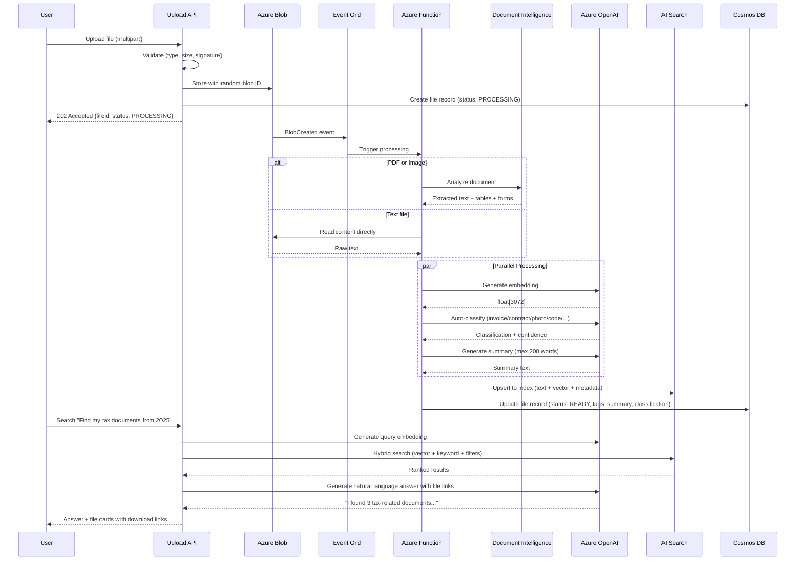
```mermaid
sequenceDiagram
    participant U as User
    participant API as Upload API
    participant Blob as Azure Blob
    participant EG as Event Grid
    participant Func as Azure Function
    participant DI as Document Intelligence
    participant OAI as Azure OpenAI
    participant Search as AI Search
    participant DB as Cosmos DB

    U->>API: Upload file (multipart)
    API->>API: Validate (type, size, signature)
    API->>Blob: Store with random blob ID
    API->>DB: Create file record (status: PROCESSING)
    API-->>U: 202 Accepted {fileId, status: PROCESSING}

    Blob->>EG: BlobCreated event
    EG->>Func: Trigger processing

    alt PDF or Image
        Func->>DI: Analyze document
        DI-->>Func: Extracted text + tables + forms
    else Text file
        Func->>Blob: Read content directly
        Blob-->>Func: Raw text
    end

    par Parallel Processing
        Func->>OAI: Generate embedding
        OAI-->>Func: float[3072]
        
        Func->>OAI: Auto-classify (invoice/contract/photo/code/...)
        OAI-->>Func: Classification + confidence
        
        Func->>OAI: Generate summary (max 200 words)
        OAI-->>Func: Summary text
    end

    Func->>Search: Upsert to index (text + vector + metadata)
    Func->>DB: Update file record (status: READY, tags, summary, classification)

    U->>API: Search "Find my tax documents from 2025"
    API->>OAI: Generate query embedding
    API->>Search: Hybrid search (vector + keyword + filters)
    Search-->>API: Ranked results
    API->>OAI: Generate natural language answer with file links
    OAI-->>API: "I found 3 tax-related documents..."
    API-->>U: Answer + file cards with download links
```

### 7.4 Implementation Phases

| Phase | Scope | Duration |
|-------|-------|----------|
| **P1: File Management Core** | Upload/download/delete; folder structure; Blob storage; Cosmos metadata; auth | 2 weeks |
| **P2: Document Intelligence** | Azure Function for OCR; PDF/image text extraction; table/form recognition | 2 weeks |
| **P3: Auto-Classification** | GPT-4o powered classification; tag generation; confidence scoring | 1-2 weeks |
| **P4: Semantic Search** | Azure AI Search index; embedding generation; hybrid search; natural language queries | 2-3 weeks |
| **P5: Smart Answers** | RAG-style Q&A over file contents; citation of source files; streaming responses | 2 weeks |
| **P6: MCP Server** | `files-mcp` exposing search + file retrieval tools | 1 week |
| **P7: Polish** | File preview (PDF/image/code); sharing; storage tier management; E2E tests | 2 weeks |

### 7.5 Acceptance Criteria

| ID | Criterion | Verification |
|----|-----------|-------------|
| FM-CORE-01 | Upload, browse, download, and delete files across folder hierarchy | E2E test: full file lifecycle |
| FM-CORE-02 | Files up to 100 MiB upload successfully with progress indication | Boundary test: 99 MiB, 100 MiB, 101 MiB |
| FM-OCR-01 | Text extraction from scanned PDFs with ≥ 95% character accuracy | Test with 20 varied document types |
| FM-OCR-02 | Processing completes within 60s for a 10-page PDF | p95 latency measurement |
| FM-CLASS-01 | Auto-classification accuracy ≥ 85% across 10 document categories | Test with 100 pre-labeled documents |
| FM-SEARCH-01 | Semantic search: "laptop purchase" returns "MacBook Pro order" documents | 30-query semantic similarity test; precision@5 ≥ 0.7 |
| FM-SEARCH-02 | Natural language answers cite the correct source file ≥ 90% of the time | Evaluation set: 50 questions with known answers |
| FM-SEC-01 | Users can only access their own files; no cross-tenant data leakage | Multi-user isolation test |
| FM-MCP-01 | MCP `search_files` tool returns relevant results for 10 test queries | MCP test client verification |

---

## 8. Cross-Cutting Concerns

### 9.1 Security Architecture (All Projects)

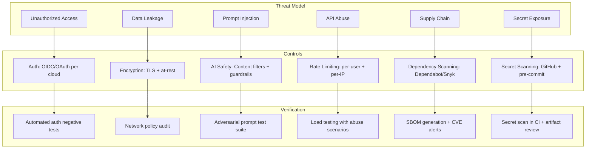
```mermaid
flowchart TB
    subgraph Threats["Threat Model"]
        direction TB
        T1["Unauthorized Access"]
        T2["Data Leakage"]
        T3["Prompt Injection"]
        T4["API Abuse"]
        T5["Supply Chain"]
        T6["Secret Exposure"]
    end

    subgraph Controls["Controls"]
        direction TB
        C1["Auth: OIDC/OAuth per cloud"]
        C2["Encryption: TLS + at-rest"]
        C3["AI Safety: Content filters + guardrails"]
        C4["Rate Limiting: per-user + per-IP"]
        C5["Dependency Scanning: Dependabot/Snyk"]
        C6["Secret Scanning: GitHub + pre-commit"]
    end

    subgraph Verification["Verification"]
        direction TB
        V1["Automated auth negative tests"]
        V2["Network policy audit"]
        V3["Adversarial prompt test suite"]
        V4["Load testing with abuse scenarios"]
        V5["SBOM generation + CVE alerts"]
        V6["Secret scan in CI + artifact review"]
    end

    T1 --> C1 --> V1
    T2 --> C2 --> V2
    T3 --> C3 --> V3
    T4 --> C4 --> V4
    T5 --> C5 --> V5
    T6 --> C6 --> V6
```

### 9.2 Observability Standard

Every project implements this observability stack:

| Layer | Azure Projects | AWS Projects | GCP Projects |
|-------|---------------|-------------|-------------|
| **Logging** | Application Insights + structured JSON | CloudWatch Logs | Cloud Logging |
| **Metrics** | App Insights Metrics | CloudWatch Metrics | Cloud Monitoring |
| **Tracing** | App Insights Distributed Tracing | X-Ray | Cloud Trace |
| **Alerting** | Azure Monitor Alerts | CloudWatch Alarms | Cloud Alerting |
| **Dashboard** | Azure Workbook | CloudWatch Dashboard | Looker Studio |

### Unified Log Schema (JSON)

```json
{
  "timestamp": "ISO-8601",
  "service": "rahulsite|creatorvault|stocksite|kidsapp|foldermanager",
  "requestId": "uuid-v4",
  "operation": "search|upload|chat|trade|...",
  "userId": "hashed-id (no PII)",
  "duration_ms": 142,
  "status": "success|error|timeout",
  "error": {
    "code": "VALIDATION_ERROR",
    "message": "sanitized message (no secrets)"
  },
  "ai": {
    "model": "gpt-4o|claude-4|gemini-2.5-pro",
    "tokens_in": 500,
    "tokens_out": 200,
    "latency_ms": 1200,
    "cached": false
  }
}
```

### 9.3 Testing Strategy

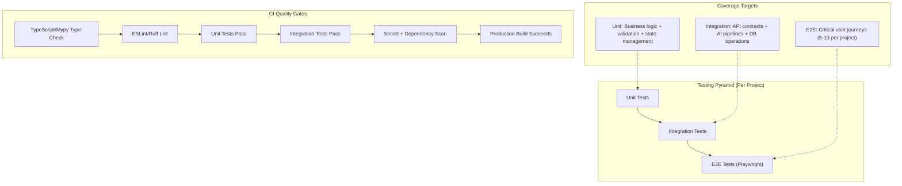
```mermaid
graph TB
    subgraph Testing_Pyramid["Testing Pyramid (Per Project)"]
        E2E["E2E Tests (Playwright)"]
        Integration["Integration Tests"]
        Unit["Unit Tests"]
    end

    subgraph Coverage_Targets["Coverage Targets"]
        E2E_Target["E2E: Critical user journeys (5-10 per project)"]
        Int_Target["Integration: API contracts + AI pipelines + DB operations"]
        Unit_Target["Unit: Business logic + validation + state management"]
    end

    subgraph Quality_Gates["CI Quality Gates"]
        TypeCheck["TypeScript/Mypy Type Check"]
        Lint["ESLint/Ruff Lint"]
        UnitGate["Unit Tests Pass"]
        IntGate["Integration Tests Pass"]
        SecScan["Secret + Dependency Scan"]
        Build["Production Build Succeeds"]
    end

    Unit --> Integration --> E2E
    Unit_Target -.-> Unit
    Int_Target -.-> Integration
    E2E_Target -.-> E2E

    TypeCheck --> Lint --> UnitGate --> IntGate --> SecScan --> Build
```

---

## 9. Infrastructure Strategy

### 10.1 Terraform Module Hierarchy

```
infrastructure-deployments/
├── modules/                          # Reusable, tested modules
│   ├── azure/
│   │   ├── webapp/                   # App Service + deployment slots
│   │   ├── cosmos-db/                # MongoDB + Gremlin APIs
│   │   ├── ai-search/                # Azure AI Search instance
│   │   ├── openai/                   # Azure OpenAI deployment
│   │   ├── function-app/             # Consumption/Premium plan functions
│   │   ├── storage/                  # Blob + lifecycle policies
│   │   ├── keyvault/                 # Secrets + access policies
│   │   ├── container-app/            # Container Apps Environment
│   │   ├── content-safety/           # Azure AI Content Safety
│   │   ├── document-intelligence/    # Azure AI Document Intelligence
│   │   └── network/                  # VNet + subnets + NSG + PE
│   ├── aws/
│   │   ├── lambda/                   # Function + layers + aliases
│   │   ├── ecs-fargate/              # Task definition + service
│   │   ├── s3/                       # Buckets + lifecycle + replication
│   │   ├── dynamodb/                 # Tables + GSI + DAX
│   │   ├── api-gateway/              # REST + WebSocket APIs
│   │   ├── step-functions/           # State machines
│   │   ├── bedrock/                  # Model access + prompt caching
│   │   ├── cognito/                  # User pools + identity pools
│   │   ├── cloudfront/               # Distribution + OAI
│   │   └── vpc/                      # VPC + subnets + NAT + SG
│   └── gcp/
│       ├── cloud-run/                # Service + revisions + traffic
│       ├── firestore/                # Database + indexes + rules
│       ├── bigquery/                 # Dataset + tables + views
│       ├── cloud-functions/          # Gen 2 functions
│       ├── pub-sub/                  # Topics + subscriptions + DLQ
│       ├── vertex-ai/                # Endpoints + fine-tuning jobs
│       ├── firebase/                 # Project + apps + extensions
│       ├── neo4j/                    # Marketplace deployment
│       └── vpc/                      # VPC + subnets + firewall
│
├── rahulsite/                        # Project 1 — Azure
│   ├── main.tf                       # Module composition
│   ├── variables.tf                  # Input variables
│   ├── outputs.tf                    # Exported values
│   ├── backend.tf                    # Azure Storage state
│   └── terraform.tfvars              # Environment values
│
├── foldermanager/                    # Project 5 — Azure
│   └── ... (same structure)
│
├── creatorvault/                     # Project 2 — AWS
│   ├── main.tf
│   ├── backend.tf                    # S3 state backend
│   └── ...
│
├── stocksite/                        # Project 3 — GCP
│   ├── main.tf
│   ├── backend.tf                    # GCS state backend
│   └── ...
│
├── kidsapp/                          # Project 4 — GCP Firebase
│   └── ... (same structure)
│
├── .github/workflows/
│   ├── infra-azure.yml               # rahulsite + foldermanager
│   ├── infra-aws.yml                 # creatorvault
│   └── infra-gcp.yml                 # stocksite + kidsapp
│
└── README.md
```

### 9.2 State Management

| Cloud | Backend | Bucket/Container | Lock |
|-------|---------|-----------------|------|
| Azure | `azurerm` | Storage Account: `tfstaterahultech` | Blob lease |
| AWS | `s3` | S3: `tfstate-creatorvault-{account-id}` | DynamoDB |
| GCP | `gcs` | GCS: `tfstate-stocksite-{project-id}` | Native |

### 9.3 Cost Guardrails (Cloud-Optimized)

| Project | Cloud | Monthly Target | Free Tier Leverage | Key Cost Drivers | Optimization Strategy |
|---------|-------|---------------|-------------------|------------------|-----------------------|
| Rahul Site | **Azure** | **≤ ₹3,500 (~$42)** | Cosmos DB free tier (1000 RU/s, 25 GB); App Service F1/B1 | OpenAI tokens, AI Search | Cache AI responses aggressively; batch embed on publish only; use AI Search free tier (50 MB / 3 indexes) |
| Folder Manager | **Azure** | **≤ ₹2,500 (~$30)** | Shares Cosmos account with Rahul Site; shared AI Search | Document Intelligence, OpenAI | Batch OCR in off-peak; cache embeddings; use consumption Function App (1M free executions/month) |
| Creator Vault | **AWS** | **≤ ₹2,000 (~$24)** | Lambda free tier (1M requests/month); S3 first 5 GB free; DynamoDB 25 GB free | Fargate tasks, Bedrock tokens, Transcribe | S3 Intelligent-Tiering; Fargate Spot for downloads; prompt caching (40-60% LLM cost reduction); Transcribe on-demand pricing |
| Stock Site | **GCP** | **≤ ₹6,500 (~$78)** | Cloud Run free tier (2M requests/month); Firestore free (1 GiB); BigQuery free (1 TB query/month) | Vertex AI fine-tuning, Pub/Sub, Zerodha API (₹2000/month) | Cloud Run min-instances=0; BigQuery partitioned tables; use Gemini Flash (not Pro) for routine tasks; model distillation for inference |
| Kids App | **GCP Firebase** | **≤ ₹1,200 (~$15)** | Firebase Spark plan: Firestore 1 GiB, Auth 10K/month, Functions 2M invocations, Hosting 10 GB | Gemini API, Cloud TTS | Pre-generate question batches (not per-request); TFLite for all offline ML; TTS audio caching in Firebase Storage; use Gemini Flash for generation |

---

## 10. MCP Integration Architecture

### 11.1 MCP Server Design Pattern

Every MCP server follows this structure:

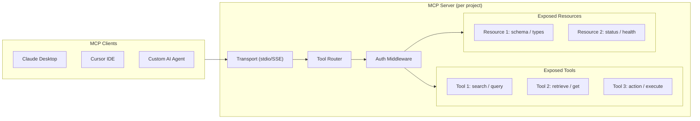
```mermaid
flowchart LR
    subgraph MCP_Server["MCP Server (per project)"]
        Transport["Transport (stdio/SSE)"]
        Router["Tool Router"]
        Auth["Auth Middleware"]
        
        subgraph Tools["Exposed Tools"]
            T1["Tool 1: search / query"]
            T2["Tool 2: retrieve / get"]
            T3["Tool 3: action / execute"]
        end
        
        subgraph Resources["Exposed Resources"]
            R1["Resource 1: schema / types"]
            R2["Resource 2: status / health"]
        end
    end

    subgraph Clients["MCP Clients"]
        Claude["Claude Desktop"]
        Cursor["Cursor IDE"]
        Custom["Custom AI Agent"]
    end

    Clients --> Transport --> Router
    Router --> Auth
    Auth --> Tools
    Auth --> Resources
```

### 11.2 MCP Server Registry

| Server | Transport | Tools | Resources |
|--------|-----------|-------|-----------|
| `rahul-knowledge-mcp` | stdio | `search_documents`, `ask_question`, `list_topics` | `schema://documents`, `status://health` |
| `creatorvault-mcp` | stdio | `search_transcripts`, `get_summary`, `list_videos` | `schema://videos`, `status://health` |
| `market-data-mcp` | SSE | `get_stock_quote`, `get_historical`, `search_news` | `schema://market`, `status://health` |
| `portfolio-mcp` | SSE | `get_holdings`, `get_pnl`, `get_trade_history` | `schema://portfolio`, `status://health` |
| `trading-mcp` | SSE | `place_order`, `cancel_order`, `get_order_status` | `schema://orders`, `status://health` |
| `files-mcp` | stdio | `search_files`, `get_file_info`, `download_file` | `schema://files`, `status://health` |

---

## 11. Master Build Sequence

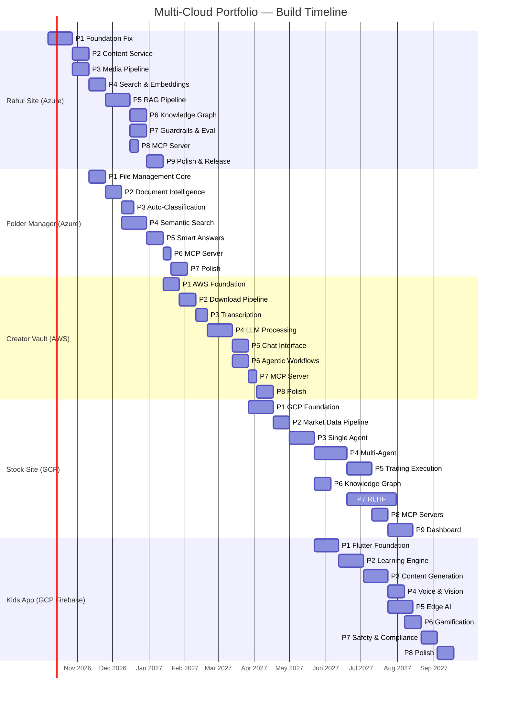
```mermaid
gantt
    title Multi-Cloud Portfolio — Build Timeline
    dateFormat  YYYY-MM-DD
    axisFormat  %b %Y

    section Rahul Site (Azure)
    P1 Foundation Fix         :rs1, 2026-10-07, 21d
    P2 Content Service        :rs2, after rs1, 14d
    P3 Media Pipeline         :rs3, after rs1, 14d
    P4 Search & Embeddings    :rs4, after rs2, 14d
    P5 RAG Pipeline           :rs5, after rs4, 21d
    P6 Knowledge Graph        :rs6, after rs5, 14d
    P7 Guardrails & Eval      :rs7, after rs5, 14d
    P8 MCP Server             :rs8, after rs5, 7d
    P9 Polish & Release       :rs9, after rs7, 14d

    section Folder Manager (Azure)
    P1 File Management Core   :fm1, after rs3, 14d
    P2 Document Intelligence  :fm2, after fm1, 14d
    P3 Auto-Classification    :fm3, after fm2, 10d
    P4 Semantic Search        :fm4, after fm2, 21d
    P5 Smart Answers          :fm5, after fm4, 14d
    P6 MCP Server             :fm6, after fm5, 7d
    P7 Polish                 :fm7, after fm6, 14d

    section Creator Vault (AWS)
    P1 AWS Foundation         :cv1, after rs9, 14d
    P2 Download Pipeline      :cv2, after cv1, 14d
    P3 Transcription          :cv3, after cv2, 10d
    P4 LLM Processing         :cv4, after cv3, 21d
    P5 Chat Interface         :cv5, after cv4, 14d
    P6 Agentic Workflows      :cv6, after cv4, 14d
    P7 MCP Server             :cv7, after cv5, 7d
    P8 Polish                 :cv8, after cv7, 14d

    section Stock Site (GCP)
    P1 GCP Foundation         :ss1, after cv5, 21d
    P2 Market Data Pipeline   :ss2, after ss1, 14d
    P3 Single Agent           :ss3, after ss2, 21d
    P4 Multi-Agent            :ss4, after ss3, 28d
    P5 Trading Execution      :ss5, after ss4, 21d
    P6 Knowledge Graph        :ss6, after ss3, 14d
    P7 RLHF                   :ss7, after ss4, 42d
    P8 MCP Servers            :ss8, after ss5, 14d
    P9 Dashboard              :ss9, after ss8, 21d

    section Kids App (GCP Firebase)
    P1 Flutter Foundation     :ka1, after ss3, 21d
    P2 Learning Engine        :ka2, after ka1, 21d
    P3 Content Generation     :ka3, after ka2, 21d
    P4 Voice & Vision         :ka4, after ka3, 14d
    P5 Edge AI                :ka5, after ka3, 21d
    P6 Gamification           :ka6, after ka4, 14d
    P7 Safety & Compliance    :ka7, after ka6, 14d
    P8 Polish                 :ka8, after ka7, 14d
```

### Build Order Rationale

| Priority | Project | Reason |
|----------|---------|--------|
| 1️⃣ | **Rahul Site** | 90% existing code; teaches RAG + embeddings + search — foundational AI concepts needed everywhere |
| 2️⃣ | **Folder Manager** | Shares Azure infra + AI services with Rahul Site; reuses search/embedding patterns |
| 3️⃣ | **Creator Vault** | Introduces AWS; serverless patterns; multimodal AI — new territory with manageable scope |
| 4️⃣ | **Stock Site** | Most complex; multi-agent + fine-tuning + Zerodha integration — needs mature AI skills from previous projects |
| 5️⃣ | **Kids App** | Fun capstone; edge AI + Flutter — leverages GCP knowledge from Stock Site |

---

## Owner Decisions Log

| Date | Decision | Resolution |
|------|----------|------------|
| 2026-10-01 | PG Site | **Dropped** — 5 projects total |
| 2026-10-01 | Stock broker | **Zerodha Kite Connect** — India market; ₹2000/month data subscription |
| 2026-10-01 | Kids App client | **Flutter** — Fastest cross-platform; native ARM compilation; Impeller engine |
| 2026-10-01 | Cost strategy | **Cloud-native free tiers first** — INR-denominated budgets; total ~₹15,700/month (~$189) across all 5 projects |

---

> [!TIP]
> **Recommended next step:** Start with Rahul Site Phase P1 (Foundation Fix) — closing the 10 gaps identified in the existing [LLD](file:///Users/rtripathi/Rahul%20Project/rahultech%20site/rahultech-web/design/LLD.md). This is the highest-impact, lowest-risk starting point.

---

*This document is a living architecture baseline. Update it with each major design decision. Version changes must include rationale, affected acceptance criteria, and updated diagrams.*
