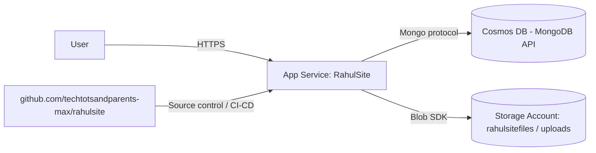

# RahulSite — Azure Infrastructure Plan (`infra.md`)

Single source of truth for what exists in Azure today, what still needs to be
created, and exactly how to wire it up. Keep this file updated any time
infrastructure changes.

---

## 1. Identity & Targets

| Item | Value |
|---|---|
| Azure Subscription | `Rahultest` (`a2482f71-5fbb-4675-a260-443f9ca766cf`) |
| Tenant | Default Directory (`851c9021-0fba-43ec-b67d-fccdad2cbb66`) |
| Resource Group | `Rahulsite` (South India) |
| Web App (existing) | `RahulSite` |
| Git Repo | https://github.com/techtotsandparents-max/rahulsite |
| App source folder | repo root (`rahultech/`) |

Login used for all `az` operations:
```bash
az login --use-device-code
az account set --subscription "Rahultest"
```

---

## 2. Existing Resources (verified)

### 2.1 App Service — `RahulSite`
- **Type**: `Microsoft.Web/sites`
- **Resource Group**: `Rahulsite`
- **Location**: South India
- **Kind**: `app,linux`
- **Runtime stack**: `NODE|24-lts`
- **SKU / Plan tier**: `Basic`
- **HTTPS only**: `true`
- **Managed Identity**: System-assigned enabled
  - Principal ID: `a15665b0-aef1-4277-bd39-6af67bb5c217`
- **Default hostname**: `rahulsite-cga7gwaye4g0f0hy.southindia-01.azurewebsites.net`

### 2.2 Storage Account — `rahulsitefiles`
- **Type**: `Microsoft.Storage/storageAccounts`
- **Location**: South India
- **Purpose**: Media storage for admin uploads
- **Container**: `uploads`
- **Blob base URL**: `https://rahulsitefiles.blob.core.windows.net/uploads`

### 2.3 Cosmos DB — `rahulsitecosmos`
- **Type**: `Microsoft.DocumentDB/databaseAccounts`
- **Location**: South India
- **API**: MongoDB
- **Purpose**: Content database for blogs, adventures, projects, videos, settings
- **Database name used by app**: `rahultech_prod`

---

## 3. Web App Settings In Use

Configured on `RahulSite`:

| App Setting | Status | Purpose |
|---|---|---|
| `AZURE_STORAGE_CONNECTION_STRING` | Configured | Blob upload access |
| `AZURE_STORAGE_CONTAINER` | `uploads` | Blob target container |
| `AZURE_STORAGE_CDN_URL` | Configured | Blob URL base |
| `COSMOS_DB_CONNECTION_STRING` | Configured | Mongo API connection |
| `COSMOS_DB_NAME` | `rahultech_prod` | App database name |
| `NEXTAUTH_URL` | Configured | NextAuth external URL |
| `NEXTAUTH_SECRET` | Configured | NextAuth session signing |
| `ADMIN_EMAILS` | Configured | Admin whitelist |
| `AZURE_AD_CLIENT_ID` | Configured | Microsoft SSO |
| `AZURE_AD_CLIENT_SECRET` | Configured | Microsoft SSO |
| `AZURE_AD_TENANT_ID` | Configured | Microsoft SSO tenant |
| `WEBSITE_AUTH_AAD_ALLOWED_TENANTS` | Existing | App Service auth |
| `MICROSOFT_PROVIDER_AUTHENTICATION_SECRET` | Existing | App Service auth secret |

Notes:
- Google OAuth is not configured right now.
- The code was updated so the admin login page only shows providers that are actually configured.

---

## 4. Application Expectations

### 4.1 Storage path
- `app/api/admin/upload/route.ts` uploads images/videos to Azure Blob Storage.
- The app expects:
  - `AZURE_STORAGE_CONNECTION_STRING`
  - `AZURE_STORAGE_CONTAINER`
  - `AZURE_STORAGE_CDN_URL`

### 4.2 Database path
- `lib/db.ts` uses `mongoose` against Cosmos DB Mongo API.
- Collections used by the app:
  - `posts`
  - `adventures`
  - `projects`
  - `videos`
  - `settings`

### 4.3 Auth path
- `lib/auth.ts` uses NextAuth.
- Microsoft provider is enabled from Azure app registration settings already attached to the Web App.
- Admin access is restricted by `ADMIN_EMAILS`.

---

## 5. Deployment Flow (Repo → GitHub → Web App)

1. Commit current repo state in `rahultech/`.
2. Add remote:
```bash
git remote add origin https://github.com/techtotsandparents-max/rahulsite.git
```
3. Push branch:
```bash
git push -u origin main
```
4. Deploy the app to Azure Web App.
5. Verify homepage, admin login, data API, and upload API.

For immediate deployment, either of these is acceptable:
- GitHub-connected deployment from App Service Deployment Center.
- Direct deployment from local source using `az webapp deploy`.

---

## 6. Data Flow Summary



---

## 7. Current Status Checklist

- [x] Resource Group `Rahulsite` exists
- [x] Web App `RahulSite` exists and is running
- [x] Storage Account `rahulsitefiles` created
- [x] Blob container `uploads` created
- [x] Cosmos DB `rahulsitecosmos` created
- [x] App settings applied to Web App
- [x] Admin auth code aligned with actual configured providers
- [ ] GitHub remote connected and code pushed
- [ ] Deployment executed from repo to Web App
- [ ] Post-deploy verification completed
