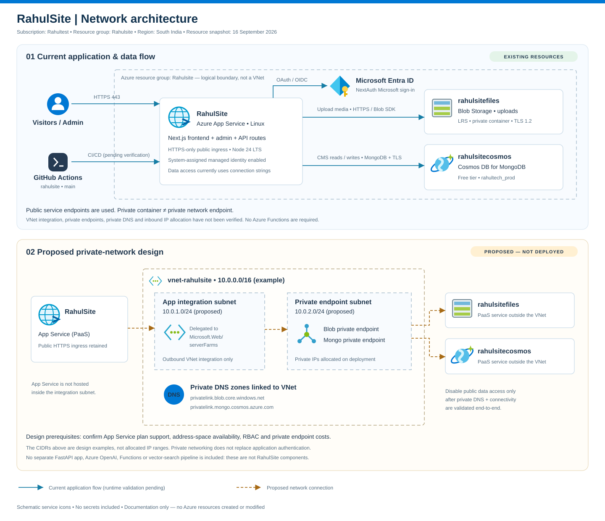
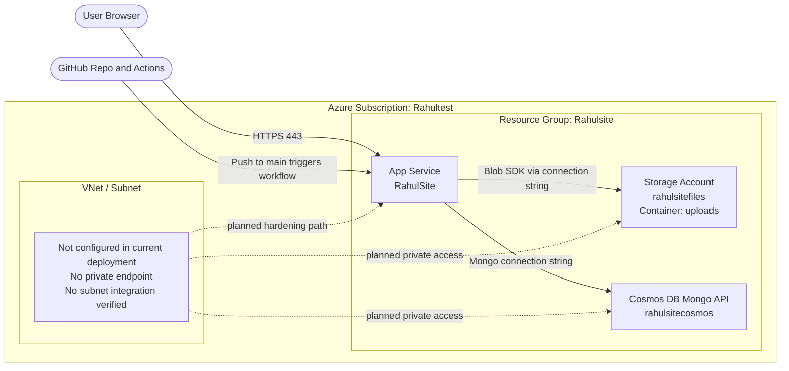
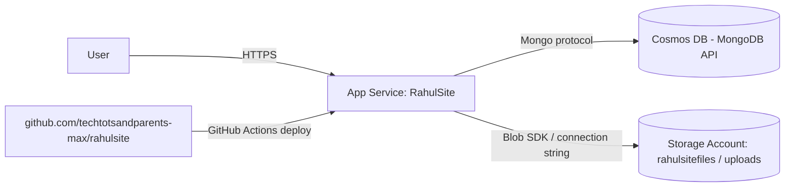

# RahulSite — Azure Infrastructure Plan (`infra.md`)

Single source of truth for the Azure resources, app settings, GitHub wiring,
and current deployment status for RahulSite.

## Illustrated Network Architecture



[Open full-size network diagram](docs/rahulsite-network.svg)

**Read the two panels separately:** the upper panel uses the resource snapshot from
16 September 2026; the lower panel is a **proposed, not deployed** network design.
VNet/subnet CIDRs are examples, not allocated ranges. Private endpoints and VNet
integration still require verification; earlier absence claims below are not a
complete networking audit. App Service integrates with a subnet for outbound
traffic; the managed App Service, Storage and Cosmos services are not placed inside it.

## 0. Infra Quick Reference

### 0.1 Resource Inventory

| Resource Name | Azure / Platform Service | Role in RahulSite | Region | Public Endpoint | Key Network Notes |
|---|---|---|---|---|---|
| `RahulSite` | Azure App Service (Linux) | Runs the Next.js frontend, admin UI, auth callbacks, and API routes | `South India` | `https://rahulsite-cga7gwaye4g0f0hy.southindia-01.azurewebsites.net` | Public ingress enabled, HTTPS only, no private endpoint, no VNet integration currently verified |
| `rahulsitefiles` | Azure Storage Account (`StorageV2`) | Stores admin-uploaded media in blob container `uploads` | `southindia` | `https://rahulsitefiles.blob.core.windows.net/` | Public endpoint in use, blob public access disabled, no private endpoint configured |
| `rahulsitecosmos` | Azure Cosmos DB for MongoDB | Stores CMS data for posts, adventures, projects, videos, and settings | `South India` | `https://rahulsitecosmos.documents.azure.com:443/` | Public network access enabled, no private endpoint configured, automatic failover enabled |
| GitHub Actions | GitHub-hosted CI/CD | Builds and deploys the repo to Azure Web App after push to `main` | GitHub SaaS | `https://github.com/techtotsandparents-max/rahulsite` | Public SaaS workflow, reaches Azure over deployment credentials |

### 0.2 IP, Encryption, and Rotation Summary

| Component | Inbound / Outbound IP Detail | Encryption Status | Secret / Key Used Today | Rotation Guidance |
|---|---|---|---|---|
| `RahulSite` | Inbound dedicated IP is not exposed by CLI on the current multitenant App Service setup. Outbound IPs: `104.211.201.94`, `13.71.66.90`, `13.71.66.145`, `104.211.205.169`, `104.211.218.57`, `13.71.67.90`, `20.235.14.7`, `20.219.107.150`, `20.235.14.25`, `20.219.121.219`, `20.219.124.7`, `20.235.14.174`, `40.78.194.99`, `40.78.194.108` | Platform-managed encryption at rest | `NEXTAUTH_SECRET`, `AZURE_AD_CLIENT_SECRET`, App Service auth secrets | Rotate app secrets in App Service settings and restart the app after each change |
| `rahulsitefiles` | Blob endpoint only; no dedicated static IP tracked here | Microsoft-managed encryption at rest via `Microsoft.Storage` | Storage account access keys through `AZURE_STORAGE_CONNECTION_STRING` | Regenerate storage key 2, update app setting, validate uploads, then rotate key 1 |
| `rahulsitecosmos` | Public Cosmos endpoint; no private IP configured | Service-managed encryption at rest, no Key Vault CMK attached | Cosmos connection string through `COSMOS_DB_CONNECTION_STRING` | Regenerate secondary key first, update app setting, validate DB access, then rotate primary key |
| GitHub Actions | No fixed IP guarantee from GitHub-hosted runners | Secrets managed by GitHub/Azure integration, not stored in repo | Deployment credential or publish-profile style secret used by workflow | Rotate the GitHub deployment secret whenever publish profile or Azure deployment credentials change |

### 0.3 Network and Infra Design Flow



Notes:
- No Azure Functions resource is part of this stack right now, so there are no Function host keys or Function key-rotation requirements to track.
- If you want stricter security later, the next step is to add VNet and subnet integration for App Service, plus private endpoints for Storage and Cosmos where supported by your plan.

---

## 1. Identity & Targets

| Item | Value |
|---|---|
| Azure Subscription | `Rahultest` (`a2482f71-5fbb-4675-a260-443f9ca766cf`) |
| Tenant | `851c9021-0fba-43ec-b67d-fccdad2cbb66` |
| Resource Group | `Rahulsite` |
| Region | `South India` |
| Web App | `RahulSite` |
| Git Repo | `https://github.com/techtotsandparents-max/rahulsite` |
| Source Folder | repo root (`rahultech/`) |
| Local Branch | `main` |

Login used for Azure CLI work:

```bash
az login --use-device-code
az account set --subscription "Rahultest"
```

---

## 2. Verified Azure Resources

### 2.1 App Service — `RahulSite`

| Property | Value |
|---|---|
| Type | `Microsoft.Web/sites` |
| Kind | `app,linux` |
| Location | `South India` |
| State | `Running` |
| HTTPS Only | `true` |
| Runtime | `NODE|24-lts` |
| Managed Identity | System-assigned |
| Principal ID | `a15665b0-aef1-4277-bd39-6af67bb5c217` |
| Default Hostname | `rahulsite-cga7gwaye4g0f0hy.southindia-01.azurewebsites.net` |
| App Service Plan | `serverFarmId` currently returns `null` via CLI |

### 2.2 Storage Account — `rahulsitefiles`

| Property | Value |
|---|---|
| Type | `Microsoft.Storage/storageAccounts` |
| Location | `southindia` |
| Kind | `StorageV2` |
| SKU | `Standard_LRS` |
| Allow Blob Public Access | `false` |
| Blob Endpoint | `https://rahulsitefiles.blob.core.windows.net/` |
| Upload Container | `uploads` |
| Container Public Access | Private (`null` in CLI output) |
| Container Last Verified | `2026-09-09T07:38:09+00:00` |

Notes:
- The storage account exists and the `uploads` container already exists.
- No `Storage Blob Data Contributor` role assignment is currently attached to the Web App managed identity for this storage account.
- The app is currently using a connection string for uploads.

### 2.3 Cosmos DB — `rahulsitecosmos`

| Property | Value |
|---|---|
| Type | `Microsoft.DocumentDB/databaseAccounts` |
| API | `MongoDB` |
| Location | `South India` |
| Free Tier | `true` |
| Consistency | `Session` |
| Public Network Access | `Enabled` |
| Document Endpoint | `https://rahulsitecosmos.documents.azure.com:443/` |
| App Database Name | `rahultech_prod` |

---

## 3. App Settings On `RahulSite`

### 3.1 Verified as configured

| Setting | Verified Value or State | Purpose |
|---|---|---|
| `AZURE_STORAGE_CONNECTION_STRING` | Present | Blob upload access |
| `AZURE_STORAGE_CONTAINER` | `uploads` | Blob target container |
| `AZURE_STORAGE_CDN_URL` | `https://rahulsitefiles.blob.core.windows.net/uploads` | Blob URL base |
| `COSMOS_DB_CONNECTION_STRING` | Present | Mongo API connection |
| `COSMOS_DB_NAME` | `rahultech_prod` | App database name |
| `NEXTAUTH_SECRET` | Present | NextAuth signing |
| `NEXTAUTH_URL` | `https://rahulsite-cga7gwaye4g0f0hy.southindia-01.azurewebsites.net` | Public auth URL |
| `ADMIN_EMAILS` | `Tripathr@outlook.com` | Admin allow-list |
| `AZURE_AD_CLIENT_ID` | `e8373ad2-26b5-4264-8cd6-5c540d2b7238` | Microsoft SSO |
| `AZURE_AD_CLIENT_SECRET` | Present | Microsoft SSO |
| `AZURE_AD_TENANT_ID` | `851c9021-0fba-43ec-b67d-fccdad2cbb66` | Tenant binding |
| `WEBSITE_AUTH_AAD_ALLOWED_TENANTS` | Present | App Service auth |
| `MICROSOFT_PROVIDER_AUTHENTICATION_SECRET` | Present | App Service auth secret |

### 3.2 Verified as not configured

| Setting | State |
|---|---|
| `GOOGLE_CLIENT_ID` | Not present |
| `GOOGLE_CLIENT_SECRET` | Not present |

Notes:
- The admin login UI was adjusted to only show providers that are actually configured.
- Azure AD auth is configured; Google auth is not currently configured.

---

## 4. Application Wiring

### 4.1 Blob upload path
- `app/api/admin/upload/route.ts` uploads files to Azure Blob Storage.
- Current auth mode is storage connection string based.
- If desired later, this can be changed to managed identity plus `DefaultAzureCredential`.

### 4.2 Database path
- `lib/db.ts` uses `mongoose` against Cosmos DB Mongo API.
- App data is stored in database `rahultech_prod`.
- Collections are created on first use by the app.

### 4.3 Auth path
- `lib/auth.ts` uses NextAuth.
- Admin access is restricted by `ADMIN_EMAILS`.
- Microsoft provider is configured from Azure app settings.

---

## 5. GitHub and Deployment State

| Item | Current State |
|---|---|
| Repo Remote | `origin -> https://github.com/techtotsandparents-max/rahulsite.git` |
| Local Commit Head | `903f17f` — merge commit containing local app code plus remote Azure workflow |
| Remote `main` | Previously contained `Initial commit` and Azure deployment workflow only |
| Workflow File | `.github/workflows/main_rahulsite.yml` exists locally and in remote history |
| Push Status | Not completed yet from current machine |
| Deploy Trigger | Expected via GitHub Actions after successful push to `main` |

What changed locally before the pending push:
- Local app history was merged with the remote repo history.
- `README.md` conflict was resolved in favor of the local project README.
- The working tree is clean and ready to push.

Next commands to finish deployment from repo to Web App:

```bash
cd "/Users/rtripathi/Rahul Project/rahultech site/rahultech"
git push -u origin main
```

After push succeeds:
- GitHub Actions should run from `.github/workflows/main_rahulsite.yml`.
- The Web App should deploy from the repo-connected workflow.
- Validate the site, admin login, uploads, and Cosmos-backed content reads/writes.

---

## 6. Data Flow Summary



---

## 7. Current Status Checklist

- [x] Resource Group `Rahulsite` exists
- [x] Web App `RahulSite` exists and is running
- [x] Storage Account `rahulsitefiles` exists
- [x] Blob container `uploads` exists
- [ ] Storage RBAC from Web App managed identity to storage account is configured
- [x] Cosmos DB `rahulsitecosmos` exists with MongoDB API free tier enabled
- [x] Required storage and Cosmos connection settings are present on the Web App
- [x] Azure AD auth settings are present on the Web App
- [x] Git remote points to `techtotsandparents-max/rahulsite`
- [x] Local repo contains the Azure deployment workflow file
- [ ] Latest local code has been pushed to GitHub `main`
- [ ] GitHub Actions deployment from the latest code has completed
- [ ] Post-deploy verification has been completed end-to-end
